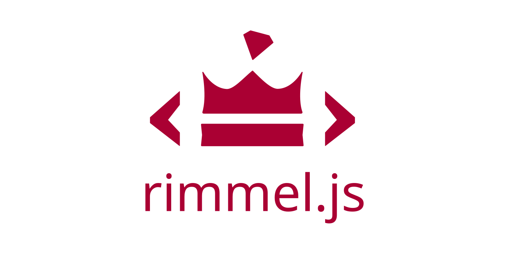
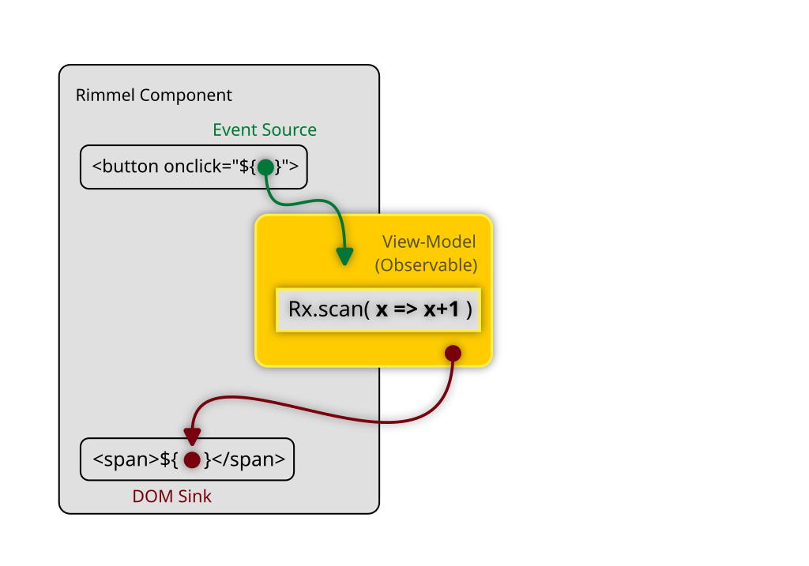
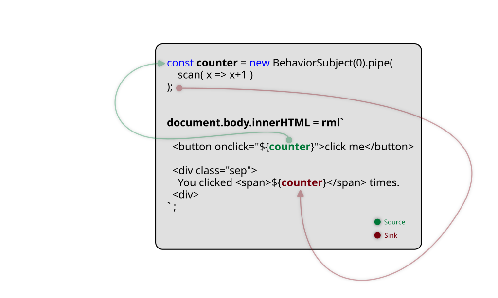
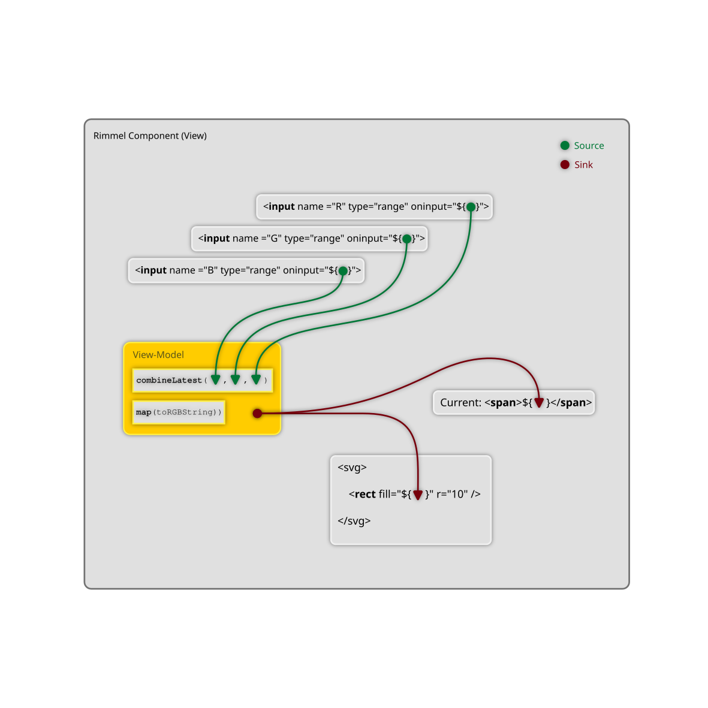
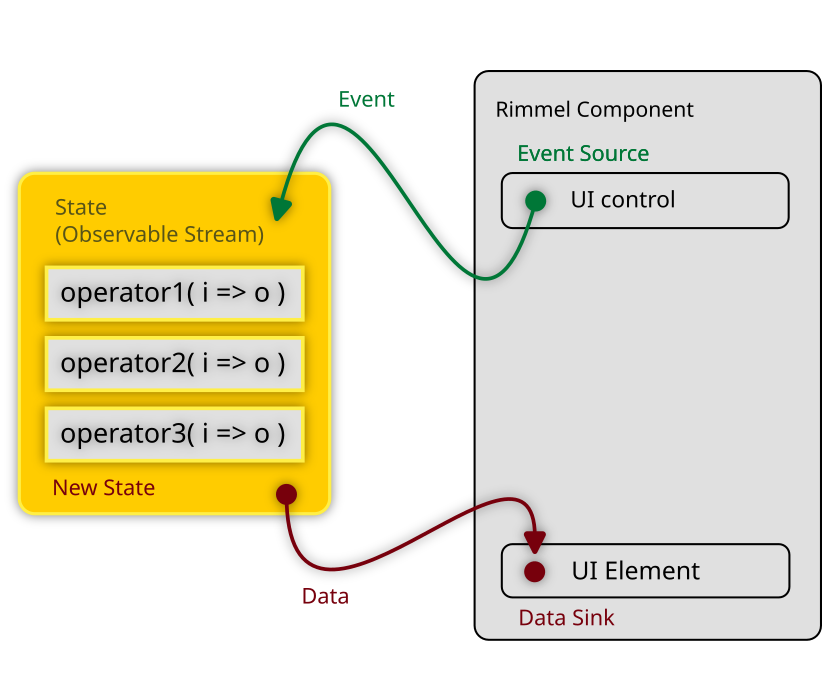
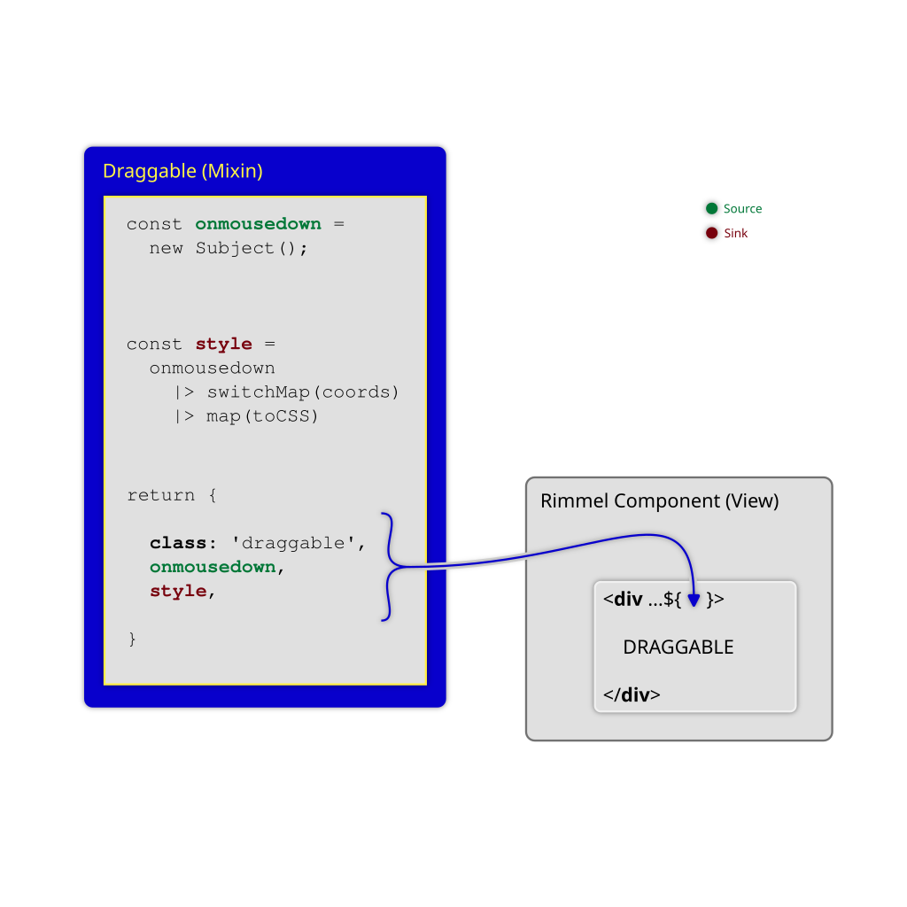

<br><br>

Rimmel lets you create a whole new world of powerful HTML templates and webapps using Observables and Promises as first-class citizens.<br>

<br>

```
<div>  ${ anObservable }  </div>
```

<br>

- When a DOM event is triggered an Observer reacts
- When an Observable emits the DOM gets updated

<br>

No need for JSX, Virtual DOM, Babel, HyperScript, Webpack, React.<br>
No need to "set up" or "tear down" observables in your components, so you can keep them pure.<br>
No need to unsubscribe or dispose of observers or perform any manual memory cleanup.

<br>

Rimmel works with standard JavaScript/TypeScript template literals tagged with `rml` out of the box.
<br>
<br>

## 👋 Hello World 👋
The modern "Hello World" for reactive interfaces is the click counter: one button, you click it, he counts it.<br>
This is how it works:



The `click` event is "sourced" into `counter`, which is an Observable Subject that takes `Event` objects and emits numbers.<br>

The result is then "sinked" into the `<span>` element at the end.



<div class="playground-link">
<a href="https://codepen.io/fourtyeighthours/pen/bGKRKqq?editors=0111"></a>&nbsp;&nbsp;&nbsp;&nbsp;<a href="https://codepen.io/fourtyeighthours/pen/bGKRKqq?editors=0111">Rimmel Hello World</a> on Codepen.
</div>

<br><br><br><hr><br><br><br>

## Imperative-Reactive? No
Most other reactive or non-reactive JavaScript UI libraries and frameworks out there are designed for the imperative programming paradigm. Occasionally they may support a few aspects of functional programming. Third-party adapters can also help with it, but the truth is that FRP was just an afterhthought and its use is severely limited in practice.

Rimmel is different in that it does primarily focus on the functional-reactive paradigm (FRP, for short).
Although some imperative-reactive patterns work, supporting them is not the main purpose of this project.

## Functional-Reactive? Yes
What makes Rimmel functional-reactive is that you can treat everything as an Observable stream, in particular event handlers and data sinks.

This means you never really write code that changes the status of something else, as in:<br />
```
target.property = value;
```

What you do instead, is you _declare_ the stream your changes come from and what better place for that if not your templates?

```
<target property="${source}">
```

## Virtual DOM? No
The concept of Virtual DOM originates from the assumption that the DOM is slow, which might be the case for some frameworks that make large numbers of unnecessary updates or re-renders, in which case it may become less expensive to run those computations outside of the DOM.

Since Rimmel never makes any unnecessary DOM update and the concept of a component re-rendering doesn't exist by itself, the whole idea of a Virtual DOM is simply not needed.

Rimmel uses Sinks, which are memory and/or performance-optimised direct DOM manipulation functions, attached to the Promises or Observable streams you provide. When there is new data, it gets sinked to the DOM immediately. You are in control of when or how often you emit data, so you can also throttle/sample/debounce as you see fit for your needs.

## Component Re-rendering? Never
Several UI libraries and frameworks around have a concept of component re-rendering, which implies running the whole component's function again in order to check its output and diff it against the DOM.
Since Rimmel makes use of reactive streams for state management, everything turned out to be dramatically simpler.

There is only one time a component is "rendered", which is when it first goes to the page. After that, only "updates" happen, which are performed with native DOM calls.

## Forward Refs? No need
Forward refs are a construct used in Imperative-Reactive UI libraries to enable referencing and later modifying DOM elements that don't exist yet.
The simple, yet effective functional paradigm used by Rimmel enables you to define any change to a DOM element as a Promise or Observable stream. This means whenever your streams emit any data, the elements will already be there to receive them, effectively making the use of Forward Refs redundant.


## Structured Data? Delegated
When you're dealing with structured data, like lists or grids of repeated data, the best way to handle it depends on multiple factors, so it's left as an extension opportunity. You can create your advanced Sinks to render complex data structures and manage specific aspects of its interactions in the most optimal way for your needs.

To display and manage the UI for any dynamic list where you plan to support CRUD operations, perhaps drag'n'drop, you may consider using an `Observable Collection` from [Observable Types](https://github.com/ReactiveHTML/observable-types), which is a rendering-aware extension of `Array`, every method of which is mapped to an optimised UI rendering command.


<br><br><br>


## 👋 Hello World👋 ++
Want a more involved example?<br>
Let's make a component featuring a Red, Green and Blue slider that get transformed into an #RRGGBB colour string, displayed in a text box and used as the fill colour of an SVG circle:



Here is the corresponding code:

```javascript
const toHex = n => n.toString(16).padStart(2, '0');
const toRGBString = rgbArr => `#${rgbArr.map(toHex).join('')}`;
const toNumericStream = x => new Subject().pipe(
  map(e => parseInt(e.target.value, 10)),
  startWith(x),
);

const ColorPicker = (initial = [0, 0, 0]) => {
  const [R, G, B] = initial.map(toNumericStream);
  const RGB = combineLatest([R, G, B]).pipe(
    map(toRGBString),
  );

  return rml`
    R: <input type="range" value="${initial[0]}" oninput="${R}">
       <span>${R}</span>

    G: <input type="range" value="${initial[1]}" oninput="${G}">
       <span>${G}</span>

    B: <input type="range" value="${initial[2]}" oninput="${B}">
       <span>${B}</span>

    Current <span>${RGB}</span>

    <svg viewbox="0 0 40 40" width="40" height="40">
      <circle fill="${RGB}" cx="20" cy="20" r="20" />
    </svg>
  `;
}

document.getElementById('rimmel-root').innerHTML = ColorPicker([255, 128, 64])
```

<br><br>

<div class="playground-link">
<a href="https://codepen.io/fourtyeighthours/pen/ExJOObG"></a>&nbsp;&nbsp;&nbsp;&nbsp;<a href="https://codepen.io/fourtyeighthours/pen/ExJOObG">Hello World Plus</a> on Codepen
</div>
<br><br>

<br>

As you can see, there are three main streams, one for each colour gauge in the HTML.
When they emit, their values are merged together through `combineLatest`, which passes them through as an array to `toRGBString` which will retutn the string as we need it.

Finally, we have two sinks where the data ends up; one as the innerHTML of the <span>, ther other as the fill colour of the SVG shape.

<br><br><br>

## State doesn't exist (it's a Stream)
"State", as the word itself suggests, is something static, so it doesn't belong to the dynamic, interactive, reactive webapps we make every day.

The rationale is that "state", as represented by plain old values such as numbers, strings and objects that are stored somewhere in memory is something you almost never need to read. Not now, not in 2 seconds, not in 45 minutes, not tomorrow. You only need those when certain events happen, in order to respond.

After that everything should go quiet, including your CPU, to keep your laptop cool until the next UI event occurs.

This is, in summary, the _discrete-functional-reactive_ paradigm behind Observables and RxJS (as opposed to the functional-reactive paradigm in general in which state is more like a continuous flow of data).

Event-driven reactivity as modelled by Observables is therefore the perfect way to describe state as it changes through the lifetime of an application at the occurrence of various discrete UI events.





Modelling your state as one or more observable streams will give you fine-grained control over async events and their coordination, thanks to the full range of RxJS operators you can use.

All Rimmel does is binding your observable streams to the UI with a seamless integration that will result in improved code quality, scale, testability and performance.


## "Lifecycle Events" are gone (you have streams)
Component lifecycle events such as `onmount`, `beforeunmount`, present in most other imperative frameworks quickly become useless and redudant here. Streams get connected and disconnected automatically for you and that happens to be what you normally do in your init/onmount function.
Using streams instead makes your code immensely cleaner and more testable.

Rimmel still has a `rml:onmount` event, but its use is only left as a last resort to integrate imperative, non-Rimmel components (some old jQuery plugins, etc?)

## Migration from/to other frameworks and libraries
This might sound unusual, but Rimmel can actually coexist with other frameworks. Your Rimmel component can be embedded in a React component and have children made in Vue, or even jQuery plugins or sit inside a larger jQuery application, or the other way around.

If you are planning to perform a progressive framework migration, this is one way you can do it, one component at a time.


<br><br><br>

# Sources vs. Sinks
There are two key concepts used by Rimmel: sources and sinks.

Sources are things that generate data which you can optionally process and transform along the way. What remains goes somewhere. That _somewhere_ is usually referred to as a sink.

Sources typically include any DOM events such as `onclick` or `onmousemove`, `fetch()` calls, just like promises in general, async functions and, most notably, Observables.

Sinks are most often the place where you want to display any information in the UI. Your main document, some HTML element, etc.

With RML/Rimmel you can treat most DOM elements as sources, sinks, or both.

## Stream Processing
Sources normally emit raw data, not meant to display in a UI (e.g.: a `ScrollEvent` or a `MouseEvent`), so what we do is to process and format them.
RxJS comes with a comprehensive set of utility functions to transform data streams, so Rimmel doesn't offer any. This enables you to choose any 

## Event Sources
Rimmel supports event listeners from all DOM elements.
Static values are treated as non-observable values and no data-binding will be created.
Observers such as Subjects and BehaviorSubjects will receive events as emitted by the DOM.

### Examples:

```ts
// Observable Subjects
const stream = new Subject<MouseEvent>();
target.innerHTML = rml`<button onclick="${stream}></button>`;


// Plain functions
const fn = (e: MouseEvent) => alert('hover');
target.innerHTML = rml`<a onmouseover="${fn}></button>`;


// Simple static values
const color = 'red';
target.innerHTML = rml`<div style="color: ${color}; background: black;">
  red on black
</div>`;
```

<br>

### Event Mapping
In normal circumstances your event handlers receive a native DOM `Event` object, such as `MouseEvent`, `PointerEvent`, etc.

To enable a better separation of concerns, as of Rimmel 1.2 you can use Event Mappers to feed your event handlers or observable streams the exact data they need, in the format they expect it, rather than the raw DOM Event objects.

Do you only need the relative `[x, y]` mouse coordinates when hovering an element?<br>
Use `<div onmousemove="${ OffsetXY(handler) }">`

Do you want the last typed character when handling keyboard events?
Use `<input oninput="${ Key(handler) }">`

Rimmel comes with a handful of Event Mappers out of the box, but you can create your own with ease.

If you know how to use the <a href="https://rxjs.dev/api/index/function/pipe">`pipe()`</a> function from RxJS, then you know how to use `reversePipe()` from Rimmel (which should probably part of RxJS). It works like `pipe()`, except it applies the same operators to data coming in, rather than going out of an observable stream.

```js
import { rml, feedIn } from 'rimmel';

const ButtonValue = map((e: PointerEvent) => Number(e.target.dataset.value));

const Component = () => {
  const total = new Subject<number>().pipe(
    scan((a, b) => a+b, 0)
  );

  return rml`
    <div onclick="${ feedIn(total, ButtonValue) }">

      <button data-value="1">one</button>
      <button data-value="2">two</button>
      <button data-value="3">three</button>

    </div>

    Sum: <span>${total}</span>
  `;
};
```

As you can see, the main data model, which is the observable stream called `total`, receives `number` and emits `number`.
The `ButtonValue` Event Mapper translates raw DOM events into the plain numbers required by the model.
Finally, we're leveraging the DOM's standard Event Delegation by only adding one listener to the container, rather than to each button.

<br>

## Data Sinks
Rimmel supports two types of sinks: specialised and dynamic sinks.
Specialised sinks are the simplest and most intuitive ones: those you define in a template from which the data binding can be easily inferred.<br />

These include:
- Class
- Dataset
- Value
- Style
- Attribute (any generic HTML attribute not listed above)
- InnerHTML, InnerText, TextContent
- Higher-Order Sinks (dynamic sinks that emit other sinks)
- Custom Sinks

Dynamic sinks can emit any of the above and will be evaluated at runtime.
Best suited for cases when flexibility is preferred over raw performance.

You can create and use your custom sinks to have fine-grained control over the rendering of particular pieces of data (E.G.: Data Collections, generic vector graphics to map or render on SVG or canvas, 3D models to translate to WebGL)

### Custom Sinks
Do you have any more specific way to display your data? You can create and use your own custom sinks. They are the opposite of Event Mappers, in that they take a stream of data and render in on the page the way you like.


### Examples:

```ts
// InnerHTML
const stream = new Subject<HTMLString>();
target.innerHTML = rml`<div>${stream}</div>`;

// Class
const stream = new Subject<CSSClassObject>();
target.innerHTML = rml`<div class="${stream}"></div>`;

// Style
const stream = new Subject<CSSStyleObject>();
target.innerHTML = rml`<div style="${stream}"></div>`;

// Data Attribute
const stream = new Subject<string>();
target.innerHTML = rml`<div data-attribute="${stream}"></div>`;

// Generic Attribute
const stream = new Subject<string>();
target.innerHTML = rml`<div some-attribute="${stream}"></div>`;

// A "Bridge" Sink (add a final step, before calling the actual sink)
const Sanitize = input => {
    type: 'sink',
    source: input.pipe(
        map(strHTML => strHTML.replace(/</g, '&lt;'))
    ),
    sink: InnerHTMLSink
};

const stream = new Subject<HTMLString>();
target.innerHTML = rml`<div>${Sanitize(stream)}</div>`;

```

<br><br><br>

## Extensible Components (AKA: Mixins)
Mixins are an exciting by-product of dynamic sinks, which allow you to inject pretty much anything at any time (event listeners, classes, attributes, etc) into a target "host" element by means of simply emitting a "DOM Object" ­­­— a plain-old object whose properties and methods represent DOM attributes and event listeners.

<br>

```javascript
const mixin = () => {
  const onmouseover = () => console.log('mouseover')

  const onclick = new Subject()

  // Emit 'clickable' first,
  // then 'clicked' afterwards
  const classes = onclick.pipe(
    mapTo('clicked-class'),
    startWith('clickable'),
  );

  // <! -----------------------------
  // The following DOM Object will be
  // "merged" into the target element
  // <! -----------------------------
  return {
    onclick,
    onmouseover,
    class: classes,
    'data-new-attribute': 'some value',
  }
}


// ----------------------------
// And this is how you call it:
// ----------------------------
const component = () => {
  return rml`
    <div ...${mixin()}></div>
  `;
}
```

<br>

When the above component is rendered on the page, the mixin will inject everything else into it, including the `onclick` and the `onmouseover` event handlers, a statically defined `data-new-attribute` and a "merge-in" observable stream, `classes` to set classes dynamically!

Whenever the `classes` stream emits, you will be able to set/unset class names in the component.

<br>

### A simple drag'n'drop mixin
A simple use case for mixins is drag'n'drop, in the form of an isolated, reusable piece of functionality.



The code above is a simple function that performs its business and returns a DOM object.
Whatever it contains is merged into the host element.
Static key-values (e.g.: `class`) are merged on the spot, before mounting.
Promises and Observables get merged whenever they resolve/emit.

<br><br>
<div class="playground-link">
<a href="https://codepen.io/fourtyeighthours/pen/YzMgXoL?editors=0010"></a>&nbsp;&nbsp;&nbsp;&nbsp;<a href="https://codepen.io/fourtyeighthours/pen/YzMgXoL?editors=0010">Draggable Mixin</a> on Codepen
</div>

<br><br><br>


# Performance

Performance is always key, isn't it?

Actually, it depends. Some studies, in fact, show that a little bit of waiting in _certain conditions_ can actually improve the overall user experience!<br>
_(Bryant&amp;Veroff, Kahneman&amp;Tversky, Brickman&amp;Campbell, Schultz)_


Anyway, Rimmel is fast. You can slow it down with the `Rx.delay()` operator if you want, but if you don't, it's fast and here's why:<br>

- It doesn't use a Virtual DOM. If you ever believed the story that the DOM is slow and re-running your components' code every time you blink an eye is the fast and good thing to do, you may have been victim of a scam.<br>

- Rimmel updates the DOM using "precharged" Sinks,which are just some little element-bound functions that won't need to perform any lookup, but are just ready to update the DOM as fast as possible.<br>
As a result, your updates in certain cases may happen even faster than the normal `document.getElementById(target).style.color = newColor`.<br>

We call it the **Vanilla+ Speed**.

- Lightweight bundle size. V1 was just 2.5KB of code. Now it's a little more as we're sorting out a few things with specialised sinks and we are in a bit of a feature rush, but the aim is to fall back below 1KB with the launch of the new template compiler.

- The rest is on you. Rimmel is a minimalistic UI library, but the reason it's so powerful is RxJS being behind its reactivity.

<br>

### Special cases
Do you have a Combobox with 1M rows?<br>
A large spreadsheet with 1k x 10k reactive cells?<br>
An HFT stock ticker with 10000 subscriptions?<br>

These are obviously edge cases where "fast updates" are obviously irrelevant.<br>
However, Rimmel can still help implementing your custom logic and optimisation patterns in an ergonomic, functional-reactive style that's easy to test and keep well organised.

<br>

## Memory management
If you come from some other libraries or frameworks, including RxJS, you know you're somewhat responsible of cleaning up memory. The indiscriminate use of Observable subscriptions can cause memory leaks in various scenarios.

Using Observables with Rimmel is trivial. All DOM subscriptions and event listeners are handled by the library behind the scenes, registered when a component is mounted and unregistered when it's removed.

<br>

## "Suspense" for free, out of the box
Do you have async data like an API call and a placeholder to display whilst waiting? We have good news: a BehaviorSubject is all you need.
The BehaviorSubject, since it has an initial, "current" value, is the perfect candidate for this, and as such, it receives a special treatment from Rimmel in that its initial value will be rendered immediately, synchronously, whilst subsequent emissions will replace it as normal.

```javascript
const WaitingComponent = () => {
  const stream = new BehaviorSubject('loading...').pipe(
    switchMap(fetch('https://api.example.com/data))
  );

  return rml`
    <div>${stream}</div>
  `
}
```
<br>


## Use with AI assistants/LLMs
We are creating a few experimental AI assistants like [RimmelGPT.js](https://chat.openai.com/g/g-L01pb60It-rimmelgpt-js), to help you convert existing components, create new ones or just get started and have fun. 

(Please note these are still highly experimental and various forms of hallucination can happen under different circumstances — YMMV)

<br>

## Building and testing
Either with bun or other runtimes:

```bash
bun install
bun run build
bun test
```

<br>

## Roadmap
- Completion handlers (what should happen when observables complete?)
- Error sinks (what if streams throw? Anything better than just "error boundaries"?)
- Performance benchmarks (we know it's fast, but, let's see the numbers!)
- SSR, Server Components, Full-Stack Components, Transferable Promises, Transferable Observables
- Scheduler support for real-time apps (trading front-ends, ad-tech, gaming, ...)
- Support text node and HTML comment sinks
- EventEmitter support?
- Separate memory-optimised and speed-optimised sinks
- Convenience vs Performance sinks
- Compiled Templates (because it's never fast enough, right?)
- JSX/ESX support?
- Plugin support
- Sink pipelines (just like you have rendering pipelines in computer graphics)
- RML Security (leverage pipelines to weed out XSS and other dirt)

<br>

## Web Standards
There are discussions going on around making HTML and/or the DOM natively support Observables at [WHATWG DOM/544](https://github.com/whatwg/dom/issues/544) and the more recent [Observable DOM](https://github.com/WICG/observable).

Rimmel is closely following these initiatives and aims to align with them as they develop.

<br>

## Contributing

[](https://github.com/reactivehtml/rimmel/stargazers)


If you like Rimmel and would like to help the functional-reactive world grow in the JavaScript land, come say hi and let's talk.
