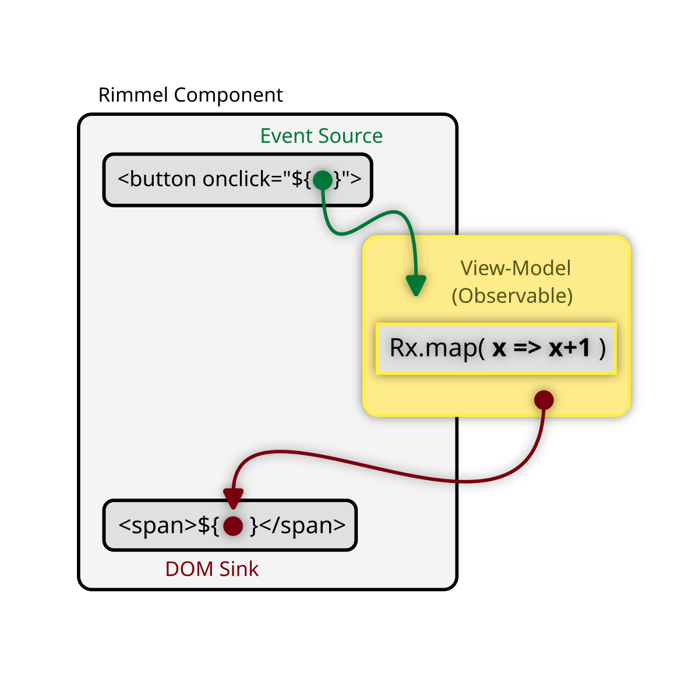

# Rimmel.js
_A Functional-Reactive UI library for the Rx.Observable Universe_

<br>

Rimmel treats Observables and Promises as fist-class citizens. No, seriously!<br />

\- An Observable emits => the DOM renders.<br />
\- The DOM emits => an Observer gets data.<br />

No dependency on JSX, HyperScript, Virtual DOM, Babel, Webpack, React, or anything else. No need to "set up" observables, no `fromEvent()` calls in your components*, no need to unsubscribe or dispose of observers, no need to perform any memory cleanup.

Rimmel uses standard JavaScript and it works out of the box.

\* with very very few exceptions

## Hello World
The modern "Hello World" for reactive stuff is a button with a click counter.
Schematically it looks as follows:

The corresponding code:

```javascript
// This click-counter is just
//  a simple in-out RxJS stream
const counter = new BehaviorSubject(0).pipe(
  scan(a => a+1) // Re-Emits 0, 1, 2, 3, ...
);

// Following comes the template.
// It simply references the observable above
// in an intuitive way, so it's clear what
// goes in (data to <span>)
// and what comes out (events from <button>).

document.body.innerHTML = rml`
    <button type="button" onclick="${counter}">
        Click me
    </button>

    Clicked <span>${counter}</span> times.
`;
```

The `onclick` above is "sourced" into `counter`, an RxJS Subject that takes `Event` objects in and spits numbers out.

The result is automatically wired back to the `<span>` by means of a `Sink`.

## Imperative-Reactive? No
Most other reactive or non-reactive JavaScript templating solutions out there are designed for the imperative programming paradigm. Occasionally they may support a few aspects of functional programming. Third-party adapters can also help with it, but the truth is that FRP was just an afterhthought, severely limiting its use in practice.

Rimmel is different in that it does primarily focus on the functional-reactive paradigm (FRP, for short).
Although some imperative-reactive patterns work, supporting them is not the main goal of this work.

## Functional-Reactive? Yes
What makes Rimmel functional-reactive is that you can treat everything as observable streams, like event handlers and data sinks.

This means you never really write code that changes the status of something, as in:<br />
```
target.property = value;
```

What you do instead, is you _declare_ which stream should your changes come from, straight in your templates:

```
<target property="${source}">
```

## Easily scalable
With Rimmel you make extensive use of _components_ — plain old functions that return a string, a "RML template" (just a normal template literal tagged with `rml`).
However, those components are just an architectural abstraction to help you organise code for large applications.

## State doesn't exist. Event streams do.
"State", as the word itself suggests, is static, so it doesn't belong to the dynamic, interactive, reactive webapps we make every day.

State, as represented by plain old values such as numbers, strings and objects that are stored somewhere in memory is something you almost never need to read. Not now, not in 2 seconds, not in 45 minutes, not tomorrow. You only need those when certain events happen, so you're able to respond.
After that, everything should go to sleep, incl your CPU to keep your laptop cool, until the next UI event occurs. Meantime, you still don't care what's the value of "x" after 3 seconds.

This is, in summary, the _discrete-functional-reactive_ paradigm behind Observables and RxJS (as opposed to the original functional-reactive paradigm in which state is almost like a continuous flow of data).

Event-driven reactivity as modelled by Observables is therefore the perfect way to describe state as it changes through the lifetime of an application at the occurrence of various discrete UI events.

Modelling your state as observable streams will give you fine-grained control over async events and their coordination, thanks to the full range of RxJS operators you can use.

All Rimmel does is binding your observable streams to the UI with a seamless integration that will result in improved code quality, scale, testability and performance.

## Lifecycle Events are not needed
The reason why other libraries and frameworks have many lifecycle events is because they only support the imperative paradigm, so with those you often need a reference to a target element (even if it doesn't exist yet, how weird) to make changes to it and there is just no other way to do many, many things.

With the declarative and functional approach supported by Rimmel, this becomes unnecessary, since you can almost always declare changes as a sink of streams. This way, Rimmel can take care of subscriptions and memory cleanup for you.

_(Psst: we've still included a few lifecycle events to help you integrate third-party imperative-js modules or libraries that really, really want an HTML node to attach to, so don't panic!)._


## Get Started
```
import { rml } from 'rimmel';
```


## Sources vs. Sinks
There are two key concepts used by Rimmel: sources and sinks.

Sources are things that generate data, which you can optionally process and transform along the way. What remains goes somewhere. That _somewhere_ is usually referred to as a sink.

Sources typically include any DOM events such as `onclick` or `onmousemove`, `fetch()` calls, just like promises in general, async functions and, most notably, Observables.

Sinks are most often the place where you want to display any information in the UI. Your main document, some HTML element, etc.

With RML/Rimmel you can treat most DOM elements as sources, sinks, or both.

## Stream Processing
Sources normally emit raw data, not meant to display in a UI (e.g.: a `ScrollEvent` or a `MouseEvent`), so what we do is to process and format them.
RxJS comes with a comprehensive set of utility functions to transform data streams.

## Event Sources
(or just Sources)

Rimmel supports event listeners from all DOM elements.
Static values are treated as non-observable values and no data-binding will be created.
Observers such as Subjects and BehaviorSubjects will receive events as emitted by the DOM.

## Data Sinks
(or just Sinks)

Rimmel supports two types of sinks: specialised and dynamic sinks.
Specialised sinks are the simplest and most intuitive ones: those you define in a template from which the data binding can be easily inferred.<br />

These include:
- Class
- Dataset
- Value
- Style
- Attribute (any generic HTML attribute not listed above)
- InnerHTML, InnerText, TextContent
- Higher-Order Sinks (dynamic sinks that emit other sinks)
- Custom Sinks

Dynamic sinks can emit any of the above and will be evaluated at runtime.
Best suited for cases when flexibility is preferred over raw performance.

You can create and use your custom sinks to have fine-grained control over the rendering of particular pieces of data (E.G.: Data Collections, generic vector graphics to map or render on SVG or canvas, 3D models to translate to WebGL)

## Mixins
Mixins are an exciting by-product of dynamic sinks, which allow you to inject pretty much anything at any time (event listeners, classes, attributes, etc) into a target "host" element by means of simply emitting a "DOM Object" ­­­— a plain-old object whose properties and methods represent DOM attributes and event listeners.


```javascript
const mixin = () => {
  const onmouseover = () => console.log('mouseover')

  const onclick = new Subject()

  // Emit 'clickable' first,
  // then 'clicked' afterwards
  const classes = onclick.pipe(
    mapTo('clicked-class'),
    startWith('clickable'),
  )
  // <! -------------------------------------------------------
  // The following DOM Object will be
  // "merged" into the target element
  return {
    onclick,
    onmouseover,
    class: classes,
    'data-new-attribute': 'some value',
  }
}


// And this is how you call it:
const component = () => {
  return rml`
    <div ...${mixin()}></div>
  `;
}
```
When the above component is rendered on the page, the mixin will inject everything else into it, including the `onclick` and `onmouseover` event handlers,
a statically defined `data-new-attribute` and a "merge-in" observable stream to set classes dynamically!

Whenever the `classes` stream emits, you will be able to set/change/toggle class names in the component.

## Use with LLMs
We are creating a few experimental AI assistants like [RimmelGPT.js](https://chat.openai.com/g/g-L01pb60It-rimmelgpt-js), to help you convert existing components, create new ones or just get started and have fun. 

(Please note these are still highly experimental and various forms of hallucination can happen under different circumstances — YMMV)

## Building and testing
```bash
bun install
bun run build
bun test
```

## Roadmap
- Completion handlers (what should happen when an observable completes?)
- Error sinks (and if it throws?)
- Performance benchmarks (we know it's fast, but... how much, exactly?)
- SSR (Transferable Promises, Transferable Observables)
- Scheduler support for real-time apps (trading front-ends, ad-tech, gaming, ...)
- Support text node and HTML comment sinks
- Possible support for the EventEmitter type as source and sink
- Separate memory-optimised and speed-optimised sinks.
- Pre-Transformed Data Sources (so you don't even have to do that)
- Compiled Templates (because it's never fast enough, right?)
- Plugin support
- Sink pipelines (just like you have rendering pipelines in computer graphics)
- RML Security (leverage pipelines to weed off XSS and other dirt)

## Web Standards alignment
There are discussions going on around making HTML and/or the DOM natively support Observables at [WHATWG DOM/544](https://github.com/whatwg/dom/issues/544) and the more recent [WICG Observable](https://github.com/WICG/observable).

Rimmel follows and aims to align with these efforts as they develop.
