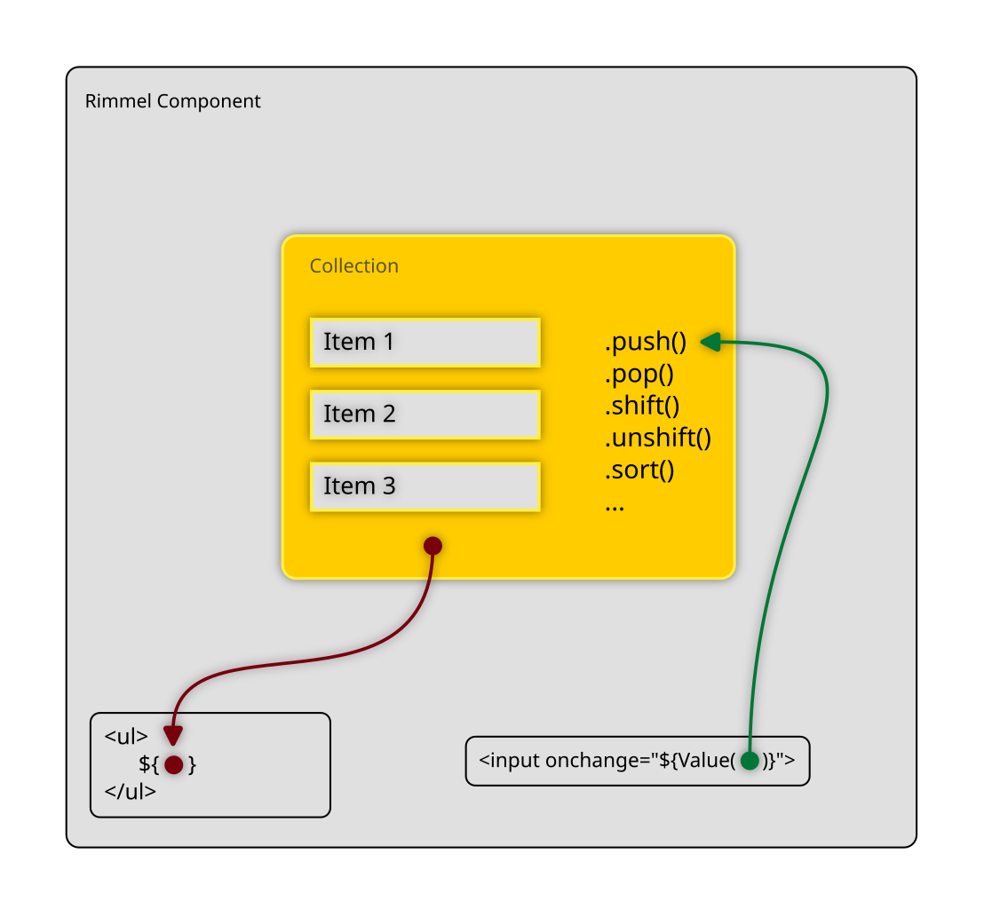
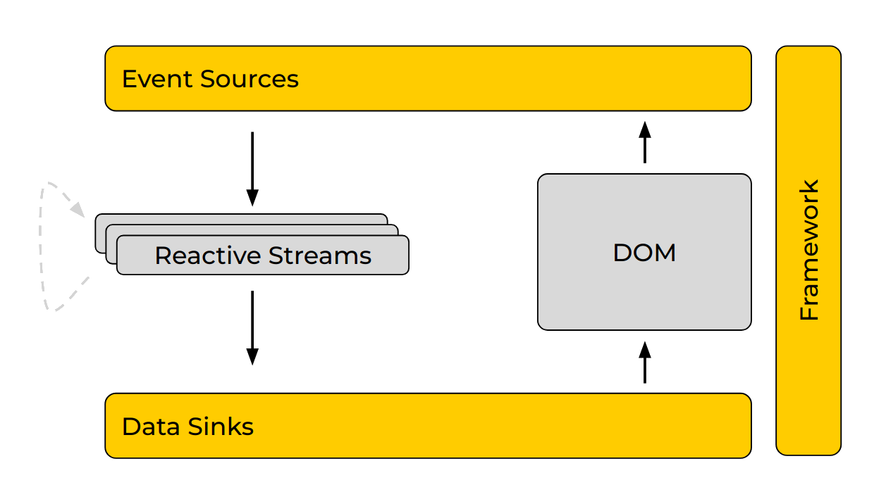
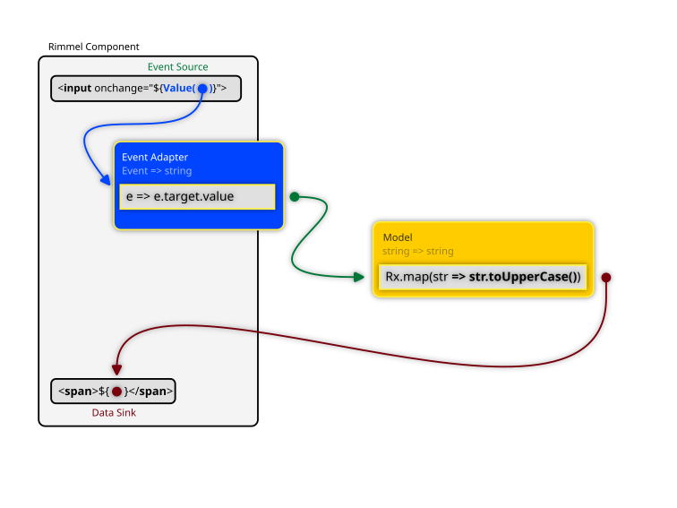

<br>

[](https://www.npmjs.com/package/rimmel)

Rimmel is a small, lightweight and fast UI library entirely built around the **Observable** and **Observer** patterns, where:

- Input Events (sources) are Observables
- Output (sinks) are Observers
- Everything in between is your streams

Writing reactive streams is easier than you think: take an input, transform it, return it. If you need a crash-course on reactive streams, tailored for UI development, check [this one](https://medium.com/@fourtyeighthours/the-mostly-inaccurate-crash-course-for-reactive-ui-development-w-rxjs-ddbb7e5e526e) out.

## 👋 Hello World 👋
The "Hello World" for reactive interfaces is the click counter: one button, you click it, he counts it.<br>
This is how it works:


The `click` event is "sourced" into `counter`, which is an Observable Subject that takes `Event` objects and emits numbers.<br>

The result is then "sinked" into the `<span>` element at the end.


<div class="playground-link">


<br>

[](https://stackblitz.com/edit/rimmel-click-counter)


## Functional-Reactive
Most JavaScript UI libraries and frameworks are designed for the Imperative Programming paradigm.
Occasionally they may also support some aspects of Functional/Functional-Reactive Programming.
Third-party adapters or utility libraries are often used to help with all this but the truth is that the functional-reactive paradigm was just an afterhthought and its use is severely limited, inconvenient or plain awkward to apply in practice.


Rimmel focuses primarily on the functional-reactive paradigm (FRP, for short), to make it "just work"!

What that means in practice is you treat nearly everything as a stream — data in, data out.

You don't write code to change the state of something else, as in:

```typescript
// The imperative way
target.property = value;
target.setProperty('prop1', value);
```

What you do instead, is you connect both ends of your stream to your component's HTML, within the template:

```javascript
const ClickCounterComponent = () => {
  // this takes click events in input
  // and emits numbers in output
  const count = new BehaviorSubject(0).pipe(
    scan(x=>x+1)
  );
  
  return rml`
    <button onclick="${count}">click me</button>

    Count: <span>${count}</span>
  `;
};
```

## No Virtual DOM
The concept of Virtual DOM originates from the assumption that the DOM is slow, which might appear to be the case for some frameworks or UI libraries that make large numbers of redundant updates or "re-renders". For those, it may be less expensive to just run those computations outside of the DOM.

Since Rimmel never causes any unnecessary DOM update and the concept of a component "re-rendering" doesn't even exist, the whole idea of a Virtual DOM is disregarded.

Rimmel uses Sinks, which are memory and/or performance-optimised direct DOM manipulation functions, attached to the Promises or Observable streams you provide. When there is new data, it gets sinked to the DOM. You are in control of when or how often you emit data, so you can also throttle/sample/debounce, use any schedulers as you see fit for your needs. RxJS provides all that, so if you know RxJS, you're ready to make the most of Rimmel.

## Conditional Rendering
If you need to render something based on a condition, plain-old standard JS can help you. No further abstractions or custom DSLs used:

```javascript
document.body.innerHTML = rml`
  <main>
    ${
      condition == true
        ? rml`<div>yes, it's true</div>`
        : rml`<div>no, it's false</div>`
    }
  </main>
```

[](https://stackblitz.com/edit/rimmel-conditional-rendering)

You only want to use this method if your condition is static, and you don't need to reflect changes over time.


### ... or streams
If you need to render based on a live, ever-changing condition, you can just use a normal Observable stream:

```javascript
// Use RxJS's `map` operator to emit any HTML based on whatever conditions you like
const conditionalStream = new BehaviorSubject(0).pipe(
  scan(x=>x+1),
  map(data => {
    if(data &1) {
      return rml`<span>${data}, is odd</span>`
    } else {
      return rml`<span>${data}, is even</span>`
    }
  })
);

document.body.innerHTML = rml`
  <div>Count: ${conditionalStream}</div>
  <button onclick="${conditionalStream}">click me</button>
`;
```

[](https://stackblitz.com/edit/rimmel-dynamic-conditional-rendering)

## No Forward Refs
Forward refs are a construct used in Imperative UI libraries to enable referencing and later modifying DOM elements that don't exist yet (you're writing components that will work on DOM nodes after they will be mounted).

Rimmel enables you to declare future changes to a DOM element by means of a simple Promise or Observable.
The mounting and data binding is completely managed by Rimmel. This means when they resolve or emit, the elements will already be there to receive them, effectively making the use of Forward Refs redundant.

## Structured Data
When you're dealing with structured data, like lists or grids of repeated data, the best way to handle it depends on multiple factors, so it's left as an extension opportunity.

You can create your custom, advanced Sinks to render data structures of any complexity and manage specific aspects of its interactions in the most optimal way for your needs.
This is a perfect case for reactive grids, spreadsheets, SVG or Canvas drawings, 3D scenes, etc.
### Dynamic Lists and Collections
If you just want to display a dynamic list of repeated elements you may want to use a `Collection` from [ObservableTypes](https://github.com/reactivehtml/observable-types), which is an Array+Observable+Observer object to make lists trivial to manage with Rimmel.

The following illustration shows how you can manage a simple list of items.




[](https://stackblitz.com/edit/observable-types-list)

<br>

## Example: RGB Sliders
Want a little more involved example of stream usage?<br>
Let's make a component featuring a Red, Green and Blue slider that get transformed into an #RRGGBB colour string, displayed in a text box and used as the fill colour of an SVG circle:


Here is the corresponding code:

```javascript
const toHex = n => n.toString(16).padStart(2, '0');
const toRGBString = rgbArr => `#${rgbArr.map(toHex).join('')}`;
const toNumericStream = x => new Subject().pipe(
  map(e => parseInt(e.target.value, 10)),
  startWith(x),
);

const ColorPicker = (initial = [0, 0, 0]) => {
  const [R, G, B] = initial.map(toNumericStream);
  const RGB = combineLatest([R, G, B]).pipe(
    map(toRGBString),
  );

  return rml`
    R: <input type="range" value="${initial[0]}" oninput="${R}">
    G: <input type="range" value="${initial[1]}" oninput="${G}">
    B: <input type="range" value="${initial[2]}" oninput="${B}">

    Current <span>${RGB}</span>

    <svg viewbox="0 0 40 40" width="40" height="40">
      <circle fill="${RGB}" cx="20" cy="20" r="20" />
    </svg>
  `;
}

document.getElementById('root-node').innerHTML = ColorPicker([255, 128, 64])
```

<br><br>

<div class="playground-link">
<a href="https://codepen.io/fourtyeighthours/pen/ExJOObG"></a>&nbsp;&nbsp;&nbsp;&nbsp;<a href="https://codepen.io/fourtyeighthours/pen/ExJOObG">RGB Sliders</a> on Codepen
</div>
<br>

As you can see, there are three main streams, one for each colour slider in the HTML.
When they emit, their values are merged together through `combineLatest`, which passes them through as an array to `toRGBString` which will return the string as we need it.

Finally, we have two sinks where the data ends up; one as the innerHTML of the <span>, ther other as the fill colour of the SVG shape.

<br>

## State doesn't exist (it's a Stream)
"State", as the word itself suggests, is something static, so it doesn't belong to the dynamic, interactive, reactive webapps we make every day.

The rationale is that "state", as represented by plain old values such as numbers, strings and objects that are stored somewhere in memory is something you almost never need to read. Not now, not in 2 seconds, not in 45 minutes, not tomorrow. You only need those when certain events happen, in order to respond.

After that, everything should go quiet, including your CPU, to keep your laptop cool until the next UI event occurs.

This is, in summary, the _discrete-functional-reactive_ paradigm behind Observables and RxJS (as opposed to the functional-reactive paradigm in general in which state is more like a continuous flow of data).

Event-driven reactivity as modelled by Observables is therefore the perfect way to describe state as it changes through the lifetime of an application at the occurrence of various discrete UI events.


Modelling your state as one or more observable streams will give you fine-grained control over async events and their coordination, thanks to the full range of RxJS operators you can use.

All Rimmel does is binding your observable streams to the UI in a seamless integration that will result in improved code quality, scale, testability and performance.

## No Lifecycle Events (you only need streams)
Component lifecycle events such as `onmount`, `beforeunmount`, present in most other imperative frameworks quickly become useless, redudant and discouraged here.
Streams and other listeners get connected and disconnected automatically for you when a component is mounted/unmounted. If you think about it, this is exactly what you would normally do in your init/onmount functions, so you no longer have to deal with these tiny details.

Since you only declare streams now and let Rimmel connect them to the DOM and each-other, your code will be immensely more concise, cleaner and more testable.

Rimmel still has a `rml:onmount` event, but its use is only left as a last resort to integrate imperative, non-Rimmel components (some old jQuery plugins, etc?)

## No Side Effects (that's what a framework is for)
You may have already realised that writing UI components with Rimmel means you no longer have to deal with UI side effects. That makes it easier to make your code purely functional by default.



# Sources vs. Sinks
There are two key concepts used by Rimmel: sources and sinks.

Sources are things that generate data which you can optionally process and transform along the way. What remains goes somewhere. That _somewhere_ is usually referred to as a sink.

Sources typically include any DOM events such as `onclick` or `onmousemove`, `fetch()` calls, just like promises in general, async functions and, most notably, Observables.

Sinks are most often the place where you want to display any information in the UI. Your main document, some HTML element, etc.

With RML/Rimmel you can treat most DOM elements as sources, sinks, or both.

## Event Sources
Rimmel supports event native and synthetic listeners from all DOM elements.
All Observers such as event listener functions, Subjects and BehaviorSubjects will receive events as emitted by the DOM.

### Examples:

```ts
// Observable Subjects
const stream = new Subject<MouseEvent>();
target.innerHTML = rml`<button onclick="${stream}></button>`;


// Plain functions
const fn = (e: MouseEvent) => alert('hover');
target.innerHTML = rml`<a onmouseover="${fn}></button>`;

// Event Delegation
const buttonClicks = new Subject<MouseEvent>().pipe(
  filter(e => e.target.tagName == 'BUTTON')
);

target.innerHTML = rml`
   <div onclick="${buttonClicks}>
     <button>button1</button>
     <button>button2</button>
     <button>button3</button>
   </div>
`;
```

<br>

### Event Adapters
In normal circumstances your event handlers receive a native DOM `Event` object, such as `MouseEvent`, `PointerEvent`, etc.

To enable a better separation of concerns you can use Event Adapters to feed your event handlers or Observable streams the exact data they need, rather than the generic, raw Event objects coming from the DOM.

Do you want the last typed character when handling keyboard events?<br>
Use `<input oninput="${ Key(handler) }">`

Do you only need the value of a text box when it's changed?<br>
Use `<input onchange="${ Value(handler) }">`

Do you also want to empty it after you've read its value?<br>
Use `<input onchange="${ Cut(handler) }">`





Rimmel comes with a handful of Event Adapters out of the box, but you can create your own with ease.
Event Adapters become particularly useful when you have a main data stream that you want to feed from different elements of different types that emit different events. Using an adapter for each, you can make sure you always get data in a unified format in your main data stream.


### Event Adapter Operators
In certain cases it can be useful to have an Event Adapter made of multiple steps.
Adapter Operators are simple RxJS operators that make it possible to create whole event adapter pipelines to better suit mode advanced needs.

If you know how to use the <a href="https://rxjs.dev/api/index/function/pipe">`pipe()`</a> function from RxJS, then you almost know how to use `source(...operators, target)` from Rimmel.
It works like `pipe()`, except it applies the same operators to data coming in, rather than going out of an Observable stream: `source(...operators, targetObserver)`

```js
import { rml, source } from 'rimmel';

const datasetValue = map((e: Event) => Number(e.target.dataset.value));
const buttonClick = filter((e: Event) => e.target.tagName == 'BUTTON');

const Component = () => {
  const total = new Subject<number>().pipe(
    scan((a, b) => a+b, 0)
  );

  return rml`
    <div onclick="${source(buttonClick, datasetValue, total)}">

      <button data-value="1">add one</button>
      <button data-value="2">add two</button>
      <button data-value="3">add three</button>

    </div>

    Sum: <span>${total}</span>
  `;
};
```

As you can see, the main data model, which is the observable stream called `total`, receives `number` and emits `number`.
The `DatasetValue` Event Adapter translates raw DOM events into the plain numbers required by the model.
Finally, we're leveraging the DOM's standard Event Delegation by only adding one listener to the container, rather than to each button. We're making sure only button clicks are captured by using the `ButtonClick` filter


### Event Adapter Functions vs Event Adapter Operators
The main difference between Event Adapters and Event Adapter Operators is that the former are designed for simplicity and convenience. Their name begins with an uppercase letter.

Adapter Operators, on the other hand, are simple, plain-old RxJS operators. Their name is camelcased and can be composed together just like other RxJS operators.

Rimmel often exports both. For instance, the `Cut` Adapter, or the `cut` Operator clear the value of a text input before emitting its value. They are convenient ways to let users repeatedly enter information and clean up a text field for the next input.

The following example illustrates the use of the `Cut` Event Adapter to feed a simple text stream. 

```js
import { rml, Cut } from 'rimmel';
import { Subject } from 'rxjs';

const Component = () => {
  const stream1 = new Subject<string>();

  return rml`
    <input onchange="${Cut(stream1)}"> <br>

    Input text: <span>${stream1}</span>
  `;
};
```

The following example, will instead use the `cut` Operator, combined with an `onEnterKey` filter and a `toUpperCase` operator to only emit and clean up the field's value when the user presses `Enter`.


```js
import { map, filter } from 'rxjs';
import { rml, source, cut } from 'rimmel';

const Component = () => {
  const onEnterKey = filter((e: KeyboardEvent) => e.key == 'Enter');
  const toUpperCase = map(s: string) => s.toUpperCase();

  const stream2 = new Subject<string>();

  return rml`
    <input onchange="${source(onEnterKey, cut, toUpperCase, stream2)}"> <br>

    Uppercased input text entered: <span>${stream2}</span>
  `;
};
```
Please note how the last parameter of `source()` is `stream2` the actual target of the input pipeline.

<br>

## Data Sinks
Rimmel supports two categories of sinks: standard (specialised) sinks and dynamic sinks.
Standard sinks are the simplest and most intuitive ones: those you define in an everyday template from which the type of data binding required can be easily inferred. They are optimised for performance, updating a specific part of the DOM.<br />

These include:
- Class (add/remove/change classes to an element)
- Dataset (add/remove/change dataset values)
- Value (set the value of an input field)
- Style (apply styles from a CSS Object/key-value pair)
- Closed (set the closed attribute of a dialog box)
- Removed (destroy an element when a source emits)
- Disabled (disable a UI control)
- Readonly (make a UI control read-only)
- InnerText, TextContent, InnerHTML, PrependHTML, AppendHTML, Sanitize
- Attribute (set any generic HTML attribute not listed above)
- Custom Sinks (create your own for specific, optimised rendering of complex data)

### Implicit vs Explicit sinks
Some sinks are implicit as the surrounding HTML and/or CSS context makes it clear what they should do.
E.g.:
```html
<!-- set class names -->
<div class="${stream}">
<!-- set inline style -->
<div style="${stream}">
<!-- set background colour -->
<div style="background-color: ${stream};">
```

Other sinks can be specified explicitly when it's not obvious from the context or when several options are available to display the same content:
```html
<!-- Remove dangerous scripts from the stream before rendering -->
<div>${Sanitize(stream)}</div>
```

```html
<!-- Sink the stream's content into `.innerText`, rahter than `.innerHTML` (which is the default) on an element -->
<div>${InnerText(stream)}</div>
```

```html
<!-- You take control and decide exactly how that stream should be rendered -->
<!-- Useful for complex data structures -->
<div>${YourCustomSink(stream)}</div>
```

### Examples (using sinks):

```ts
// InnerHTML (this is implicit, from the context)
const stream = new Subject<HTMLString>();
target.innerHTML = rml`<div>${stream}</div>`;

// InnerText (the easy way to prevent XSS)
const stream = new Subject<HTMLString>();
target.innerHTML = rml`<div>${InnerText(stream)}</div>`;

// Class
const stream = new Subject<CSSClassObject>();
target.innerHTML = rml`<div class="${stream}"></div>`;

// Style
const stream = new Subject<CSSStyleObject>();
target.innerHTML = rml`<div style="${stream}"></div>`;

// CSS
const stream = new Subject<string>();
target.innerHTML = rml`<div style="color: ${stream};"></div>`;

// Data Attribute
const stream = new Subject<string>();
target.innerHTML = rml`<div data-attribute="${stream}"></div>`;

// Disabled Attribute
const stream = new Subject<boolean>();
target.innerHTML = rml`<button disabled="${stream}">clickable</button>`;

// Removed (this is a RML attribute, not a standard HTML one)
const stream = new Subject<boolean>();
target.innerHTML = rml`<div rml:removed="${stream}"></div>`;

// Closed
const stream = new Subject<boolean>();
target.innerHTML = rml`<dialog closed="${stream}">...</dialog>`;

// Generic Attribute
const stream = new Subject<string>();
target.innerHTML = rml`<div some-attribute="${stream}"></div>`;

// "Sanitize" - display render-safe HTML
import { rml, Sanitize } from 'rimmel';

const stream = new Subject<HTMLString>();
target.innerHTML = rml`<div>${Sanitize(stream)}</div>`;

// A "Custom" Sink to just make output uppercase
const UpperCase = sink(
  map(strHTML => strHTML.toUpperCase())
);

const stream = new Subject<HTMLString>();
target.innerHTML = rml`<div>${UpperCase(stream)}</div>`;
```

Dynamic sinks, on the other hand, are optimised for size and designed for convenience. They can take anyhing as input and figure out how to update the DOM at runtime.


## Extensible Components (Mixins)
Mixins are an exciting by-product of dynamic sinks, which allow you to inject pretty much anything at any time (event listeners, classes, attributes, etc) into the target "host" element by means of emitting a `DOM Object`­— a plain-old object whose properties and methods represent DOM attributes and event listeners.

<br>

```javascript
const Mixin = () => {
  const onmouseover = () => console.log('mouseover')

  const onclick = new Subject()

  // Emit 'clickable' first,
  // then 'clicked' afterwards
  const classes = onclick.pipe(
    mapTo('clicked-class'),
    startWith('clickable'),
  );

  // <! -----------------------------
  // The following DOM Object will be
  // "merged" into the target element
  // <! -----------------------------
  return {
    onclick,
    onmouseover,
    class: classes,
    'data-new-attribute': 'some value',
  }
}

// ----------------------------
// And this is how you call it:
// ----------------------------
const component = () => {
  return rml`
    <div ...${Mixin()}></div>
  `;
}
```

<br>

When the above component is rendered on the page, the mixin will inject everything else into it, including the `onclick` and the `onmouseover` event handlers, a statically defined `data-new-attribute` and a "merge-in" observable stream, `classes` to set classes dynamically.

Whenever the `classes` stream emits, you will be able to set/unset class names in the component.

#### No reference to the host element
You may have noticed that mixins doesn't get any reference to the elements you merge them into.

In the imperative paradigm you would indeed have one, so you can imperatively set `hostElement.classList.add('big')`.

In order to stick with good functional principles, mixins only return this `DOM Object`, which is a declarative way to tell Rimmel what you want it to set on the host element.

```js
  const returnValue = <DOMObject>{
    onclick,
    onmouseover,
    'class': classes,
    'data-new-attribute': 'some value',
    'rml:closed': closedStream,
    'disabled': disabledStream,
    'readonly': readonlyStream,
    'innerHTML': contentStream1,
    'appendHTML': contentStream2,
    // etc...
  }
```

<br>

### A simple drag'n'drop mixin
A simple use case for mixins is drag'n'drop, in the form of an isolated, reusable piece of functionality.


The code above is a simple function that performs its business and returns a DOM object.
Whatever it contains is merged into the host element.
Static key-values (e.g.: `class`) are merged on the spot, before mounting.
Promises and Observables get merged whenever they resolve/emit.

<br><br>
<div class="playground-link">
<a href="https://codepen.io/fourtyeighthours/pen/YzMgXoL?editors=0010"></a>&nbsp;&nbsp;&nbsp;&nbsp;<a href="https://codepen.io/fourtyeighthours/pen/YzMgXoL?editors=0010">Draggable Mixin</a> on Codepen
</div>

[](https://stackblitz.com/edit/rimmel-draggable)
[](https://stackblitz.com/edit/rimmel-draggable-deferred)

<br>


# Performance

Performance is always key, isn't it?

Actually, it depends. Some studies, in fact, show that a little bit of waiting in _certain conditions_ can actually improve the overall user experience! _(Bryant&amp;Veroff, Kahneman&amp;Tversky, Brickman&amp;Campbell, Schultz)_


Anyway, Rimmel is fast. You can slow it down with the `Rx.delay()` operator if you want, but if you don't, it's fast and here's why:<br>

- It doesn't use a Virtual DOM. If you ever believed the story that the DOM is slow and re-running your components' code every time you blink an eye is the fast and good thing to do, you may have been the victim of a scam.<br>

- Rimmel updates the DOM using "precharged" Sinks, which are just some little element-bound functions that won't need to perform any lookup, but are just ready to update the DOM as fast as possible.<br>
As a result, your updates in certain cases may happen even faster than the normal `document.getElementById(target).style.color = newColor`.<br>

We call this the **Vanilla+ Speed**.

- Lightweight bundle size. V1 was just 2.5KB of code. Now it's a little more as we're sorting out a few things with specialised sinks and we are in a bit of a feature rush, but the aim is to fall back below 1KB with the launch of the new template compiler.

- The rest is on you. Rimmel is a minimalistic UI library, but the true reason for its immense power is RxJS being behind its reactivity.

<br>

### Special cases of "fast"
Do you have a Combobox with 1M rows?<br>
A large spreadsheet with 1k x 10k reactive cells?<br>
An HFT stock ticker with 10000 subscriptions?<br>

These are obviously cases where "fast updates" or raw speed are irrelevant and what truly matters is adequate frontend architecture.<br>

These are perfect cases to create Custom Sinks implementing relevant design patterns to make extreme scenarios still work optimally in an ergonomic, functional-reactive style that's easy to test and keep well organised.

<br>

## Memory management
If you come from some other libraries or frameworks, including "vanilla RxJS", you know you're somewhat responsible of cleaning up memory. The indiscriminate use of Observable subscriptions without proper cleanup can cause memory leaks in certain scenarios.

Using Observables with Rimmel is trivial. All DOM subscriptions and event listeners are handled by the library behind the scenes, registered when a component is mounted and unregistered when it's removed.

<br>

## "Suspense" for free, out of the box
Do you have async data like an API call and a placeholder to display whilst waiting? We have good news: a `BehaviorSubject` is all you need.

A `BehaviorSubject` receives a special treatment from Rimmel in that its initial value will be rendered immediately, synchronously, whilst subsequent emissions will replace it as normal. This helps avoid unnecessary reflows and jank on the page.

```javascript
import { ajax } from 'rxjs/ajax';

const WaitingComponent = () => {
  const stream = new BehaviorSubject('loading...');

  ajax.getJSON('https://api.example.com/data')
    .pipe(map(data => `<pre>${JSON.stringify(data, null, 2)}</pre>`))
    .subscribe(stream)
  ;

  return rml`
    <div>${stream}</div>
  `;
}
```
<br>

<a href="https://stackblitz.com/edit/rimmel-suspense"></a>&nbsp;&nbsp;&nbsp;&nbsp;<a href="https://stackblitz.com/edit/rimmel-suspense">Suspense</a> on Stackblitz.


## The little gotcha!
Never forget to tag your templates with `rml`, otherwise they won't be reactive.
This is a standard piece of HTML string: 
```ts
const str = `<div>hello</div>`
```

And this is a reactive template managed by Rimmel:
```ts
const str = rml`<div>hello</div>`
```

## Migrating from/to other frameworks
It might sound unusual, but Rimmel can actually coexist with other frameworks.
Your Rimmel component can be embedded in a React component and have children made in Vue, or even jQuery plugins or sit inside a larger jQuery application, or any other way around.

If you are planning a progressive framework migration, you can do it one component at a time.

## Use with AI assistants/LLMs
We have created a few experimental AI assistants like [RimmelGPT.js](https://chat.openai.com/g/g-L01pb60It-rimmelgpt-js), to help you convert existing components, create new ones or just get started and have fun. 

(Please note these are still highly experimental and various forms of severe hallucination can happen under different circumstances — YMMV)

<br>

## TodoMVC - the Rimmel way
Want to delve deeper into more advanced scenarios? Have a look at the following todo app all based on RxJS streams, [ObservableTypes](https://github.com/reactivehtml/observable-types) and Rimmel.

[](https://stackblitz.com/edit/rimmel-todomvc)

## Tic-Tac-Toe - with Streams
Here's a version of Tic Tac Toe made with Observable Streams

[](https://stackblitz.com/edit/tic-tac-toe-rimmeljs)

## A Colour Picker component
In a component like a colour picker there's a lot of derived state to manage, from various inputs and controls, mouse and touch actions, copy-paste, drag'n'drop.
RxJS can handle these without blinking an eye whilst Rimmel just glues them together.

Remember, this is complex by nature and without RxJS it would be much worse!

[](https://stackblitz.com/edit/rimmel-color-picker)

<hr>

[](https://github.com/reactivehtml/rimmel/stargazers)

# Get in touch!
Rimmel is a young project built with meticulous attention to detail and a bold vision: building a web ecosystem that "just works", using the functional-reactive paradigm.

Share the passion? Would like to help? That'd be hugely appreciated!<br>
Come say Hi, there's a lot of work to do. The Roadmap is below.

# Roadmap
- Completion handlers (what should happen when observables complete?)
- Error sinks (what if streams throw? Anything better than just "error boundaries"?)
- Performance benchmarks (we know it's fast, but, let's see the numbers!)
- SSR, Server Components, Full-Stack Components, Transferable Promises, Transferable Observables
- Scheduler support for real-time apps (trading front-ends, ad-tech, gaming, ...)
- Support text node and HTML comment sinks
- EventEmitter support?
- Separate memory-optimised and speed-optimised sinks
- Convenience vs Performance sinks
- Compiled Templates (because it's never fast and light enough, right?)
- JSX/ESX support?
- Plugin support
- Sink pipelines (just like you have rendering pipelines in computer graphics)
- RML Security (leverage sink pipelines to weed out XSS and other dirt)
- i18n (leverage sink pipelines to make localisation trivial)

# Building, testing and hacking
To work with Rimmel locally, check it out then either with bun or other runtimes:

```bash
npm install
npm run test
npm run build
```

There is a "kitchen sink" app you can use to play around locally, which should showcase most of what you can do with Rimmel:
```bash
npm run kitchen-sink
vite
```

Or you can just run it with one click [on StackBlitz](https://stackblitz.com/~/github.com/ReactiveHTML/rimmel?file=examples/kitchen-sink/index.ts&startScript=kitchen-sink)

# Web Standards
There are discussions going on around making HTML and/or the DOM natively support Observables at [WHATWG DOM/544](https://github.com/whatwg/dom/issues/544) and the more recent [Observable DOM](https://github.com/WICG/observable).

Rimmel is closely following these initiatives and aims to align with them as they develop,
