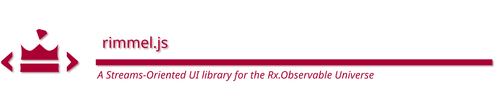

[](https://www.npmjs.com/package/rimmel)

Rimmel is a powerful, fast and lightweight JavaScript UI library for creating web applications with event streams.

It implements the [RML/Reactive Markup](https://github.com/ReactiveHTML/reactive-markup) specification, which means everything in your code is a stream: it takes an input, you apply your business logic and it takes care of the rest.

## Getting started
If you are new to reactive streams, there is a [3m crash-course](https://medium.com/@fourtyeighthours/the-mostly-inaccurate-crash-course-for-reactive-ui-development-w-rxjs-ddbb7e5e526e) tailored for UI development with Rimmel, arguably the simplest RxJS introduction around to get you started.

If you are new to the functional/reactive programming mindset, this [interactive tutorial](https://reactivex.io/learnrx/) may be an especially useful introduction to map/reduce in the reactive world.

## Hello World 👋🌏🏖️😎
Let's jump straight in. The "Hello World" for reactive user interfaces is the classic click counter: one button, you click it, ze counts it.


<!-- <iframe src="https://stackblitz.com/edit/rimmel-click-counter?ctl=1&embed=1&file=main.ts" width="100%" height="500" frameborder="0"></iframe> -->


The click event from the `<button>` above is plugged into `counter` — a simple stream of events to numbers —
and the output is plugged into the `<span>` element at the end.

No need for anything else. No need to attach, connect, disconnect, clean up or anything. Rimmel does it all for you in pure JavaScript/TypeScript without any "dark magic".

You've probably never seen anything like this before, so just go and try it:

[](https://stackblitz.com/edit/rimmel-click-counter)


## Streams Oriented
Most JavaScript UI libraries and frameworks are designed for the imperative programming paradigm.
Occasionally they may also support some aspects of reactive or functional programming, too.
Third-party adapters or utility libraries can also be used to translate between each paradigm but the reality is that the imperative paradigm is their main focus and everything else was just an afterhthought, severely limited, inconvenient or plain awkward to use in practice.

Rimmel was designed to make reactive streams just work.

### Everything is a Stream ☄️
This is the key concept of the paradigm. Instead of creating variables, classes, object and methods that perform mutations, you create streams. A stream is data-in, data-out. Can be sync or async and combine other streams.

You no longer write code to change the state of something else, as in:

```javascript
// Imperative Programming
target = newValue;

// Object Oriented (Imperative) Programming
target.property = value;
target.setProperty('prop1', value);
```

What you do instead, is you define all your application logic as streams, then you connect both ends of them to your HTML (Rimmel will know when to connect the input or the output from the context):

```javascript
// Streams Oriented
const stream = <your stream here>;

const template = rml`
  <button onclick="${stream}">click me</button>
  Total clicks: <b>${stream}</b>
`;
```

## No Virtual DOM 🚀
The concept of Virtual DOM originates from the assumption that the DOM is slow, which might appear to be the case if a framework makes a large number of unnecessary, uncontrolled updates, also known as "re-renders".
In that case it may be computationally cheaper to just run those outside of the DOM.

Rimmel does never ever cause any unnecessary DOM updates by design. The concept of a component "re-rendering" doesn't exist, so the whole idea of a Virtual DOM is unneeded. This helps keeping your apps very light and very fast.

All changes to your page are applied using _Sinks_, which are memory and/or performance-optimised direct DOM manipulation functions, directly attached to the Promises or Observable streams you provide. All data you emit gets sinked to the DOM immediately.
You have complete control over when and how you emit data, so for simple apps you just don't care, and in the most extreme circumstances you can throttle, sample, debounce, use various schedulers at will.

RxJS provides all that, so if you know some RxJS, you're ready to get the most out of Rimmel.

## No Forward Refs 🪧
Forward refs are a construct used in Imperative UI libraries to enable referencing and later modifying DOM elements that don't exist yet (you're writing components that will work on DOM nodes after they will be mounted).

Rimmel enables you to declare future changes to a DOM element by means of a simple Promise or Observable.
The mounting and data binding is completely managed by Rimmel. This means when they resolve or emit, the elements will already be there to receive them, effectively making the use of Forward Refs redundant.

## Lists and Structured Data ⚙️
When you're dealing with structured data, like lists or grids of repeated data, the best way to handle it depends on multiple factors, so it's left as an extension opportunity.

You can create your custom, advanced Sinks to render data structures of any complexity and manage specific aspects of its interactions in the most optimal way for your needs.
This is a perfect case for reactive grids, spreadsheets, SVG or Canvas drawings, 3D scenes, etc.

### Dynamic Lists and Collections 📝
If you just want to display a dynamic list of repeated elements you may want to use a `Collection` from [ObservableTypes](https://github.com/reactivehtml/observable-types), which is a convenient Array+Observable+Observer hybrid to make lists absolutely trivial to manage with Rimmel.

The following illustration shows how you can display a simple list of items.


Conceptually simple, just as much as the code. you'll be amazed how simple and powerful it is to use:

[](https://stackblitz.com/edit/observable-types-list)

<br>

## Example: RGB Colour Sliders 🌈
Want a little more involved example of stream usage?<br>
Let's make a component featuring a Red, a Green and a Blue slider that will get transformed into an #RRGGBB colour string, displayed in a text box and used as the fill colour of an SVG circle.

Visually, this is what it's going to look like:


Here is the corresponding code:

```javascript
const toHex = n => n.toString(16).padStart(2, '0');
const toRGBString = rgbArr => `#${rgbArr.map(toHex).join('')}`;
const toNumericStream = x => new Subject().pipe(
  map(e => parseInt(e.target.value, 10)),
  startWith(x),
);

const ColorPicker = (initial = [0, 0, 0]) => {
  const [R, G, B] = initial.map(toNumericStream);
  const RGB = combineLatest([R, G, B]).pipe(
    map(toRGBString),
  );

  return rml`
    R: <input type="range" value="${initial[0]}" oninput="${R}">
    G: <input type="range" value="${initial[1]}" oninput="${G}">
    B: <input type="range" value="${initial[2]}" oninput="${B}">

    Current <span>${RGB}</span>

    <svg viewbox="0 0 40 40" width="40" height="40">
      <circle fill="${RGB}" cx="20" cy="20" r="20" />
    </svg>
  `;
};

document.getElementById('root-node').innerHTML = ColorPicker([255, 128, 64])
```

<br><br>

<div class="playground-link">
<a href="https://codepen.io/fourtyeighthours/pen/ExJOObG"></a>&nbsp;&nbsp;&nbsp;&nbsp;<a href="https://codepen.io/fourtyeighthours/pen/ExJOObG">RGB Sliders</a> on Codepen
</div>
<br>

As you can see, there are three main streams, one for each colour slider in the HTML.
When they emit, their values are merged together through <a href="https://rxjs.dev/api/index/function/combineLatest" target="_blank">`combineLatest`</a>, which passes them through as an array to `toRGBString` which will return the string as we need it.

Finally, we have two sinks where the data ends up; one as the innerHTML of the <span>, ther other as the fill colour of the SVG shape.

<br>

## State doesn't exist. It's a Stream ✴️
"State", as the word itself suggests, is something static, so it doesn't belong to the dynamic, interactive, reactive webapps we make every day.

The rationale is that "state", as represented by plain old values such as numbers, strings and objects that are stored somewhere in memory is something you almost never need to read. Not now, not in 2 seconds, not in 45 minutes, not tomorrow. You only need those when certain events happen, in order to respond.

After that, everything should go quiet, including your CPU, to keep your laptop cool until the next UI event occurs.

This is, in summary, the _discrete functional/reactive_ paradigm behind Observables and RxJS (as opposed to the functional-reactive paradigm in general in which state is more like a continuous flow of data over time).

Event-driven reactivity as modelled by Observables is therefore the perfect way to describe state as it changes through the lifetime of an application at the occurrence of various discrete UI events.


Modelling your state as one or more observable streams will give you fine-grained control over async events and their coordination, thanks to the full range of RxJS operators you can use.

All Rimmel does is binding your observable streams to the UI in a seamless integration that will result in improved code quality, scale, testability and performance.

## Conditional Rendering made simple ☂️
If you need to render something based on a condition, plain-old standard JS can help you. No further abstractions or custom DSLs are required:

```javascript
document.body.innerHTML = rml`
  <main>
    ${
      condition == true
        ? rml`<div>yes, it's true</div>`
        : rml`<div>no, it's false</div>`
    }
  </main>
```

[](https://stackblitz.com/edit/rimmel-conditional-rendering)

You only want to use this method if your condition is static, and you don't need to reflect changes over time.


### ... or with conditional streams ☔
If you need to render based on a live, ever-changing condition, you can just use a normal Observable stream:

```javascript
// Use RxJS's `map` operator to emit any HTML based on whatever conditions you like
const conditionalStream = new BehaviorSubject(0).pipe(
  scan(x=>x+1),
  map(data => {
    if(data &1) {
      return rml`<span>${data}, is odd</span>`
    } else {
      return rml`<span>${data}, is even</span>`
    }
  })
);

document.body.innerHTML = rml`
  <div>Count: ${conditionalStream}</div>
  <button onclick="${conditionalStream}">click me</button>
`;
```

[](https://stackblitz.com/edit/rimmel-dynamic-conditional-rendering)

## No Lifecycle Events 🕢
Component lifecycle events such as `onmount`, `beforeunmount`, present in most other imperative frameworks quickly become useless, redudant and discouraged here.
Streams and other listeners get connected and disconnected automatically for you when a component is mounted/unmounted. If you think about it, this is exactly what you would normally do in your init/onmount functions, so you no longer have to deal with these tiny details.

Since you only declare streams now and let Rimmel connect them to the DOM and each-other, your code will be immensely more concise, cleaner and more testable.

Rimmel still has a `rml:onmount` event, but its use is only left as a last resort to integrate imperative, non-Rimmel components (some old jQuery plugins, etc?)

## No Side Effects (that's what a framework is for) 🌋
You may have already realised that writing UI components with Rimmel means you no longer have to deal with UI side effects. That makes it easier to make your code purely functional by default.


# Event Sources and Data Sinks ⚖️
There are two key concepts used by Rimmel: sources and sinks.

Sources are things that generate data which you can optionally process and transform along the way. What remains goes somewhere. That _somewhere_ is usually referred to as a sink.

Sources typically include any DOM events such as `onclick` or `onmousemove`, `fetch()` calls, just like promises in general, async functions and, most notably, Observables.

Sinks are most often the place where you want to display any information in the UI. Your main document, some HTML element, etc.

With RML/Rimmel you can treat most DOM elements as sources, sinks, or both.

## Event Sources (getting data from the DOM) ↗️
Rimmel supports event native and synthetic listeners from all DOM elements.
All Observers such as event listener functions, Subjects and BehaviorSubjects will receive events as emitted by the DOM.

### Examples:

```ts
// Observable Subjects
const stream = new Subject<MouseEvent>();
target.innerHTML = rml`<button onclick="${stream}></button>`;


// Plain functions
const fn = (e: MouseEvent) => alert('hover');
target.innerHTML = rml`<a onmouseover="${fn}></button>`;

// Event Delegation
const buttonClicks = new Subject<MouseEvent>().pipe(
  filter(e => e.target.tagName == 'BUTTON')
);

target.innerHTML = rml`
   <div onclick="${buttonClicks}>
     <button>button1</button>
     <button>button2</button>
     <button>button3</button>
   </div>
`;
```

<br>

### Event Adapters ➿
In normal circumstances your event handlers receive a native DOM `Event` object, such as `MouseEvent`, `PointerEvent`, etc.

To enable a better separation of concerns you can use Event Adapters to feed your event handlers or Observable streams the exact data they need, rather than the generic, raw Event objects coming from the DOM.

Do you want the last typed character when handling keyboard events?<br>
Use `<input oninput="${ Key(handler) }">`

Do you only need the value of a text box when it's changed?<br>
Use `<input onchange="${ Value(handler) }">`

Do you also want to empty it after you've read its value?<br>
Use `<input onchange="${ Cut(handler) }">`


Rimmel comes with a handful of Event Adapters out of the box, but you can create your own with ease.
Event Adapters become particularly useful when you have a main data stream that you want to feed from different elements of different types that emit different events. Using an adapter for each, you can make sure you always get data in a unified format in your main data stream.


### Event Adapter Operators
In certain cases it can be useful to have an Event Adapter made of multiple steps.
Adapter Operators are simple RxJS operators that make it possible to create whole event adapter pipelines to better suit mode advanced needs.

If you know how to use the <a href="https://rxjs.dev/api/index/function/pipe">`pipe()`</a> function from RxJS, then you almost know how to use `source(...operators, target)` from Rimmel.
It works like `pipe()`, except it applies the same operators to data coming in, rather than going out of an Observable stream: `source(...operators, targetObserver)`

```js
import { rml, source } from 'rimmel';

const datasetValue = map((e: Event) => Number(e.target.dataset.value));
const buttonClick = filter((e: Event) => e.target.tagName == 'BUTTON');

const Component = () => {
  const total = new Subject<number>().pipe(
    scan((a, b) => a+b, 0)
  );

  return rml`
    <div onclick="${source(buttonClick, datasetValue, total)}">

      <button data-value="1">add one</button>
      <button data-value="2">add two</button>
      <button data-value="3">add three</button>

    </div>

    Sum: <span>${total}</span>
  `;
};
```

As you can see, the main data model, which is the observable stream called `total`, receives `number` and emits `number`.
The `DatasetValue` Event Adapter translates raw DOM events into the plain numbers required by the model.
Finally, we're leveraging the DOM's standard Event Delegation by only adding one listener to the container, rather than to each button. We're making sure only button clicks are captured by using the `ButtonClick` filter


### Event Adapter Functions vs Event Adapter Operators
The main difference between Event Adapters and Event Adapter Operators is that the former are designed for simplicity and convenience. Their name begins with an uppercase letter.

Adapter Operators, on the other hand, are plain-old RxJS operators. Their name is camelcased and can be composed together just like other RxJS operators.

Rimmel often exports both. For instance, the `Cut` Adapter, or the `cut` Operator clear the value of a text input before emitting its value. They are convenient ways to let users repeatedly enter information and clean up a text field for the next input.

The following example illustrates the use of the `Cut` Event Adapter to feed a simple text stream. 

```js
import { rml, Cut } from 'rimmel';
import { Subject } from 'rxjs';

const Component = () => {
  const stream1 = new Subject<string>();

  return rml`
    <input onchange="${Cut(stream1)}"> <br>

    Input text: <span>${stream1}</span>
  `;
};
```

The following example, will instead use the `cut` Operator, combined with an `onEnterKey` filter and a `toUpperCase` operator to only emit and clean up the field's value when the user presses `Enter`.


```js
import { map, filter } from 'rxjs';
import { rml, source, cut } from 'rimmel';

const Component = () => {
  const onEnterKey = filter((e: KeyboardEvent) => e.key == 'Enter');
  const toUpperCase = map(s: string) => s.toUpperCase();

  const stream2 = new Subject<string>();

  return rml`
    <input onchange="${source(onEnterKey, cut, toUpperCase, stream2)}"> <br>

    Uppercased input text entered: <span>${stream2}</span>
  `;
};
```
Please note how the last parameter of `source()` is `stream2` the actual target of the input pipeline.

<br>

## Data Sinks (making changes to the DOM) ↘️
Rimmel supports two categories of sinks: standard (specialised) sinks and dynamic sinks.
Standard sinks are the simplest and most intuitive ones: those you define in an everyday template from which the type of data binding required can be easily inferred. They are optimised for performance, updating a specific part of the DOM.<br />

These include:
- Class (add/remove/change classes to an element)
- Dataset (add/remove/change dataset values)
- Value (set the value of an input field)
- Style (apply styles from a CSS Object/key-value pair)
- Closed (set the closed attribute of a dialog box)
- Removed (destroy an element when a source emits)
- Disabled (disable a UI control)
- Readonly (make a UI control read-only)
- InnerText, TextContent, InnerHTML, PrependHTML, AppendHTML, Sanitize
- Attribute (set any generic HTML attribute not listed above)
- Custom Sinks (create your own for specific, optimised rendering of complex data)

### Implicit vs Explicit sinks
Some sinks are implicit as the surrounding HTML and/or CSS context makes it clear what they should do.
E.g.:
```html
<!-- set class names -->
<div class="${stream}">
<!-- set inline style -->
<div style="${stream}">
<!-- set background colour -->
<div style="background-color: ${stream};">
```

Other sinks can be specified explicitly when it's not obvious from the context or when several options are available to display the same content:
```html
<!-- Remove dangerous scripts from the stream before rendering -->
<div>${Sanitize(stream)}</div>
```

```html
<!-- Sink the stream's content into `.innerText`, rahter than `.innerHTML` (which is the default) on an element -->
<div>${InnerText(stream)}</div>
```

```html
<!-- You take control and decide exactly how that stream should be rendered -->
<!-- Useful for complex data structures -->
<div>${YourCustomSink(stream)}</div>
```

### Examples (using sinks):

```ts
// InnerHTML (this is implicit, from the context)
const stream = new Subject<HTMLString>();
target.innerHTML = rml`<div>${stream}</div>`;

// InnerText (the easy way to prevent XSS)
const stream = new Subject<HTMLString>();
target.innerHTML = rml`<div>${InnerText(stream)}</div>`;

// Class
const stream = new Subject<CSSClassObject>();
target.innerHTML = rml`<div class="${stream}"></div>`;

// Style
const stream = new Subject<CSSStyleObject>();
target.innerHTML = rml`<div style="${stream}"></div>`;

// CSS
const stream = new Subject<string>();
target.innerHTML = rml`<div style="color: ${stream};"></div>`;

// Data Attribute
const stream = new Subject<string>();
target.innerHTML = rml`<div data-attribute="${stream}"></div>`;

// Disabled Attribute
const stream = new Subject<boolean>();
target.innerHTML = rml`<button disabled="${stream}">clickable</button>`;

// Removed (this is a RML attribute, not a standard HTML one)
const stream = new Subject<boolean>();
target.innerHTML = rml`<div rml:removed="${stream}"></div>`;

// Closed
const stream = new Subject<boolean>();
target.innerHTML = rml`<dialog closed="${stream}">...</dialog>`;

// Generic Attribute
const stream = new Subject<string>();
target.innerHTML = rml`<div some-attribute="${stream}"></div>`;

// "Sanitize" - display render-safe HTML
import { rml, Sanitize } from 'rimmel';

const stream = new Subject<HTMLString>();
target.innerHTML = rml`<div>${Sanitize(stream)}</div>`;

// A "Custom" Sink to just make output uppercase
const UpperCase = sink(
  map(strHTML => strHTML.toUpperCase())
);

const stream = new Subject<HTMLString>();
target.innerHTML = rml`<div>${UpperCase(stream)}</div>`;
```

Dynamic sinks, on the other hand, are optimised for size and designed for convenience. They can take anyhing as input and figure out how to update the DOM at runtime.


## Attribute Mixins
Mixins are an exciting by-product of dynamic sinks, which allow you to inject pretty much anything at any time (event listeners, classes, attributes, etc) into an element by means of emitting an `Attribuend Object`­—a plain-old object whose properties and methods represent DOM attributes and event listeners to be merged in.

<br>

```javascript
const Mixin = () => {
  const onmouseover = () => console.log('mouseover')

  const onclick = new Subject()

  // Emit 'clickable' first,
  // then 'clicked' afterwards
  const classes = onclick.pipe(
    mapTo('clicked-class'),
    startWith('clickable'),
  );

  // <! -----------------------------
  // The following Attribuend Object will be
  // "merged" into the host element
  // <! -----------------------------
  return {
    onclick,
    onmouseover,
    class: classes,
    'data-new-attribute': 'some value',
  }
}

// ----------------------------
// And this is how you call it:
// ----------------------------
const component = () => {
  return rml`
    <div ...${Mixin()}></div>
  `;
}
```

<br>

When the above component is rendered on the page, the mixin will inject everything else into it, including the `onclick` and the `onmouseover` event handlers, a statically defined `data-new-attribute` and a "merge-in" observable stream, `classes` to set classes dynamically.

Whenever the `classes` stream emits, you will be able to set/unset class names in the component.

#### No reference to the host element 🧙🏽‍♂️
You may have noticed that mixins don't get any reference to the elements you merge them into.

In the imperative paradigm you would indeed have one, because you would set `hostElement.classList.add('big')`.

Here we do it declaratively instead, by returning an attribuend object for Rimmel to take care of.

```js
  const returnValue = {
    onclick,
    onmouseover,
    'class': classes,
    'data-new-attribute': 'some value',
    'rml:closed': closedStream,
    'disabled': disabledStream,
    'readonly': readonlyStream,
    'innerHTML': contentStream1,
    'appendHTML': contentStream2,
    // etc...
  }
```

<br>

### A simple drag'n'drop mixin 🐭
A perfect use case for mixins is drag'n'drop, in the form of an isolated, reusable piece of functionality.


The code above is a simple function that performs its business and returns an object of attribuends (prospective attributes): whatever it contains will be merged into the host element on mount.
Promises and Observables will be merged whenever they resolve/emit.


<br><br>
<div class="playground-link">
<a href="https://codepen.io/fourtyeighthours/pen/YzMgXoL?editors=0010"></a>&nbsp;&nbsp;&nbsp;&nbsp;<a href="https://codepen.io/fourtyeighthours/pen/YzMgXoL?editors=0010">Draggable Mixin</a> on Codepen
</div>

&nbsp;

[](https://stackblitz.com/edit/rimmel-draggable)

<br>


# Performance 🚀

Performance is always a priority and here's what makes Rimmel extremely fast:<br>

- It doesn't use a Virtual DOM. If you ever believed the story that the DOM is slow and re-running your components' code every time you blink an eye is the way to do, you may have been the victim of a scam.<br>

- Rimmel updates the DOM using "precharged" Sinks, which are nothing more than some tiny element-bound "preloaded" functions that can make some of your updates even faster than the the usual `document.getElementById(target).classList.add('big')`.<br>
We call this the **Vanilla+ Speed**.

- Lightweight bundle size. V1 was just 2.5KB of code. Now it's a little more as we're sorting out a few things with specialised sinks and we are in a bit of a feature rush, but most features are tree shakeable, so if you don't import and use every piece of functionality, your bundle will always be smaller than the full package. The aim is to fall back below 1KB with the launch of the new template compiler.

- The rest is on you. Rimmel is a minimalistic UI library but the true reason for its immense power is RxJS being behind its reactivity.

<br>

### Special cases of "fast" 🐰
Do you have a Combobox with 1M rows?<br>
A large spreadsheet with 1k x 10k reactive cells?<br>
An HFT stock ticker with 10000 subscriptions?<br>

These are obviously cases where "fast updates" or raw speed are irrelevant and what truly matters is adequate frontend architecture.<br>

These are perfect cases to create Custom Sinks implementing relevant design patterns to make extreme scenarios still work optimally in an ergonomic, streams-oriented style that's easy to test and keep well organised.

<br>

## Memory management 🧠
If you come from some other libraries or frameworks, including "vanilla RxJS", you know you're somewhat responsible of cleaning up memory. The indiscriminate use of Observable subscriptions without proper cleanup can cause memory leaks in certain scenarios.

Using Observables with Rimmel is trivial. All DOM subscriptions and event listeners are handled by the library behind the scenes, registered when a component is mounted and unregistered when it's removed.

<br>

## "Suspense" for free, out of the box ⚔️
Do you have async data like an API call and a placeholder to display whilst waiting? We have good news: a `BehaviorSubject` is all you need.

A `BehaviorSubject` receives a special treatment from Rimmel in that its initial value will be rendered immediately, synchronously, whilst subsequent emissions will replace it as normal. This helps avoid unnecessary reflows and jank on the page.

```javascript
import { ajax } from 'rxjs/ajax';

const WaitingComponent = () => {
  const stream = new BehaviorSubject('loading...');

  ajax.getJSON('https://api.example.com/data')
    .pipe(map(data => `<pre>${JSON.stringify(data, null, 2)}</pre>`))
    .subscribe(stream)
  ;

  return rml`
    <div>${stream}</div>
  `;
}
```
<br>

<a href="https://stackblitz.com/edit/rimmel-suspense"></a>&nbsp;&nbsp;&nbsp;&nbsp;<a href="https://stackblitz.com/edit/rimmel-suspense">Suspense</a> on Stackblitz.


## Never forget this 🚸
In standard JavaScript you can create simple template literals or tagged templates.

In order to create a reactive template with Rimmel you need to tag your templates with `rml`. Easy to forget if you are new to tagged templates.

```ts
// This is a simple template literal (non reactive): 
const str = `<div>hello</div>`

// And this is a reactive template managed by Rimmel:
const str = rml`<div>hello</div>`
```

## Migrating from/to other frameworks 🚶🏽‍♀️
It might sound unusual, but Rimmel can actually coexist with other frameworks.
Your Rimmel component can be embedded in a React component and have children made in Vue, or even jQuery plugins or sit inside a larger jQuery application, or the way around.

If you are planning a progressive framework migration, you can do it one component at a time.

# Web Standards 🏁
There are ongoing discussions around making HTML and/or the DOM natively support Observables at [WHATWG DOM/544](https://github.com/whatwg/dom/issues/544).

The Google-led [Observable DOM](https://github.com/WICG/observable) initiative is bringing Observables natively to the web platform. You can use native Observables in Chrome today.<br>
Rimmel is the first UI library with experimental support for this proposal. Visit [this page](https://stackblitz.com/edit/observables-rimmel-observatures) to see them in action.

The Web Components incubator is creating a new proposal to bring [native tagged templates](https://github.com/WICG/webcomponents/issues/1069) to the DOM.

Rimmel is closely following the above standardisation initiatives and aims to align with them as they develop or new usage patterns emerge.


# Examples, examples, examples 🛟

There are several collections on Stackblitz that can get you started, give you inspiration or show you advanced design patterns.

There are several collections on Stackblitz that can get you started, give you inspiration or show you advanced design patterns.

[The Basics](https://stackblitz.com/@dariomannu/collections/rimmel-js-getting-started) 🧺 A good place to start off. Simple examples for simple tasks.

[The Collection](https://stackblitz.com/@dariomannu/collections/rimmel-js-experiments) 🧞 Streams-Oriented programming examples using Rimmel.

### Experiments
Cutting-edge things you can do with Rimmel. Still being refined here and there, but will show you where things are moving and bring some inspiration.

[Web Components](https://stackblitz.com/@dariomannu/collections/web-components) 🧩 Experimental support for custom elements and web components in streams-oriented style.

[Web Workers](https://stackblitz.com/@dariomannu/collections/web-workers) 🛠️ Experiments running your Rimmel components inside web workers

[Novel Design Patterns](https://stackblitz.com/@dariomannu/collections/novel-design-patterns) 📖 What makes streams-oriented programming different

[Observable Polyfill](https://stackblitz.com/@dariomannu/collections/observable-polyfill) 🧴 streams-oriented examples for the [observable-polyfill](https://github.com/keithamus/observable-polyfill/).

[Native Observables](https://stackblitz.com/orgs/github/ReactiveHTML/collections/native-observables-in-rimmel-js) 👶 Experiments using native Observables.

### The classics

#### TodoMVC 🗒️
The reference implementation to compare apples with apples.

[TodoMVC 1](https://stackblitz.com/edit/rimmel-todomvc) 🥇 A size-packed version in 100 lines of code, just for a quick glance and people who like concise code

[TodoMVC 2](https://stackblitz.com/edit/rimmel-todomvc-expanded) 🥈 A more human-readable, expanded version if you want to examine more in detail what's going on.

This TodoMVC implementation uses [ObservableTypes](https://github.com/reactivehtml/observable-types) 🪞, a reactive Collection with streams-oriented programming in mind.


#### Tic-Tac-Toe 🎮
Here's a version of Tic Tac Toe made with Observable Streams

[TicTacToe](https://stackblitz.com/edit/tic-tac-toe-rimmeljs) 🎮 a fairly-compressed and minimalistic version of the game

[TicTacToe (barebones)](https://stackblitz.com/edit/barebones-tic-tac-toe) 🕹️ a barebones version of the game in 45 lines of code, an example for the bundlephobic to see how much we can squeeze our code


#### A Colour Picker 🌈
In a component like a colour picker there's a lot of derived state to manage, from various inputs and controls, mouse and touch actions, copy-paste, drag'n'drop.
RxJS can handle these without blinking an eye whilst Rimmel just glues them together.

[Rimmel Colour Picker](https://stackblitz.com/edit/rimmel-color-picker)

This is one of the most complex UI components by nature, with so many pieces of interdependent state all over the place.
Not the example you'd want to start with, but definitely one where the use of streams makes a big mess much easier to manage.

<hr>

# Get in touch! 💬

[](https://github.com/reactivehtml/rimmel/stargazers)

Rimmel is a young project built with meticulous attention to detail and a bold vision: building a new web ecosystem that "just works", using the streams oriented paradigm.

Share the passion? Would like to help?<br>
Come say hi, there's a good amount of work to do and the roadmap is below.

# Roadmap 👷
- Completion handlers (what should happen when observables complete?)
- Error sinks (what if streams throw? Anything better than just "error boundaries"?)
- Performance benchmarks (we know it's fast, but, let's see the numbers!)
- SSR, Server Components, Full-Stack Components, Transferable Promises, Transferable Observables
- Scheduler support for real-time apps (trading front-ends, ad-tech, gaming, ...)
- Support for text nodes and HTML comment sinks
- Non-Observable streams support? (EventEmitters, Callbags, Callforwards)
- Separate memory-optimised and speed-optimised sinks
- Convenience vs Performance sinks
- Compiled Templates (because it's never fast and light enough, right?)
- JSX/ESX support?
- Plugin support — Making Rimmel modular
- Sink pipelines (just like you have rendering pipelines in computer graphics)
- RML Security (leverage sink pipelines to weed out XSS and other dirt)
- i18n (leverage sink pipelines to make localisation trivial)
- Native Observables — exciting challenges for the upcoming standard

# Building, testing, hacking 🪓
To work with Rimmel locally, check it out then either with bun or other runtimes:

```bash
npm install
npm run test
npm run build
```

There is a "kitchen sink" app you can use to play around locally, which should showcase most of what you can do with Rimmel:
```bash
npm run kitchen-sink
```

Or you can just run it with one click [on StackBlitz](https://stackblitz.com/~/github.com/ReactiveHTML/rimmel?file=examples/kitchen-sink/index.ts&startScript=kitchen-sink)

