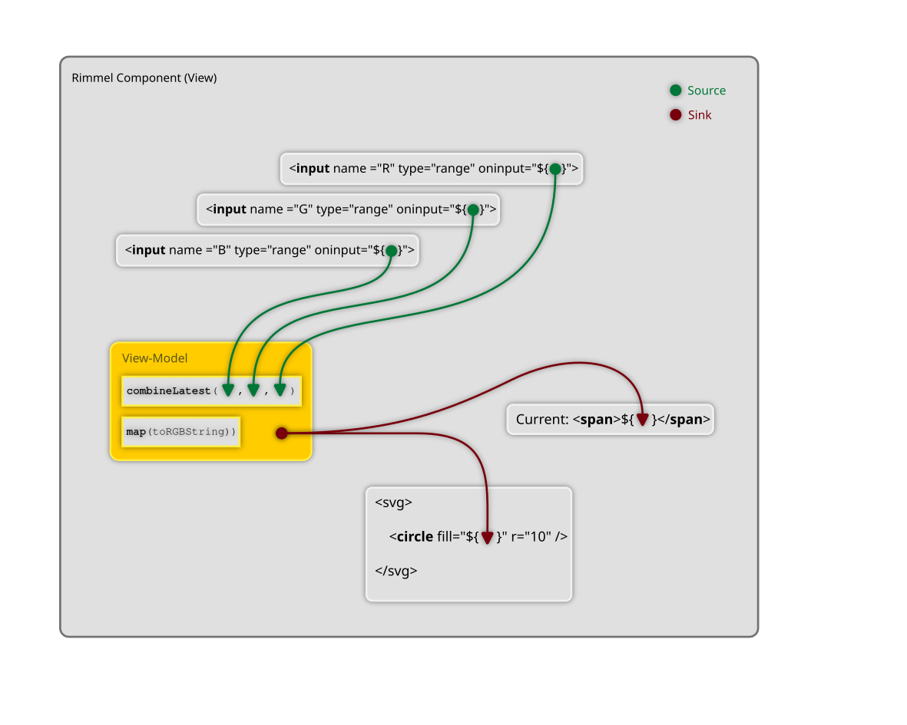

With Rimmel you can create a whole new world of powerful HTML templates and webapps using Observables and Promises as first-class citizens.<br>

<br>

```
<button onclick="${anObserver}"></div>
<div>${anObservable}</div>
```


## Hello World
The modern "Hello World" for reactive interfaces is the click counter: one button, one text box.<br>


The `onclick` above is "sourced" into `counter`, an RxJS Subject that takes `Event` objects in and spits numbers out.

The result is wired back to the `<span>` by means of a `Sink`.

Try it on [Codepen](https://codepen.io/fourtyeighthours/pen/bGKRKqq?editors=0111)

<br>

## Imperative-Reactive? No
Most other reactive or non-reactive JavaScript templating solutions out there are designed for the imperative programming paradigm. Occasionally they may support a few aspects of functional programming. Third-party adapters can also help with it, but the truth is that FRP was just an afterhthought, severely limiting its use in practice.

Rimmel is different in that it does primarily focus on the functional-reactive paradigm (FRP, for short).
Although some imperative-reactive patterns work, supporting them is not the main goal of this work.

<br>

## Functional-Reactive? Yes
What makes Rimmel functional-reactive is that you can treat everything as observable streams, like event handlers and data sinks.

This means you never really write code that changes the status of something, as in:<br />
```
target.property = value;
```

What you do instead, is you _declare_ which stream should your changes come from, straight in your templates:

```
<target property="${source}">
```

<br>

## Hello World "Plus"
Want a more involved example?<br>
Let's make a component featuring a Red, Green and Blue gauge that get transformed into a full RGB colour string sinked back into a text box and the colour of an SVG circle:



Here is the corresponding code:

```javascript
const toHex = n => n.toString(16).padStart(2, '0');
const toRGBString = rgbArr => `#${rgbArr.map(toHex).join('')}`;

const ColorPicker = (initial = [0, 0, 0]) => {
  const [R, G, B] = initial.map(x=>
    new Subject().pipe(
      map(e=>parseInt(e.target.value, 10)),
      startWith(x),
    ),
  );

  const RGB = combineLatest([R, G, B]).pipe(
    map(toRGBString),
  );

  return rml`
    R:
    <input type="range" min="0" max="255" value="${initial[0]}" oninput="${R}">
    <span>${R}</span>
    <br>

    G:
    <input type="range" min="0" max="255" value="${initial[1]}" oninput="${G}">
    <span>${G}</span>
    <br>

    B:
    <input type="range" min="0" max="255" value="${initial[2]}" oninput="${B}">
    <span>${B}</span>
    <br>

    Current <span>${RGB}</span>
    <br>

    <svg viewbox="0 0 40 40" width="40" height="40">
      <circle fill="${RGB}" cx="20" cy="20" r="20" />
    </svg>
  `;
}

document.getElementById('rimmel-root').innerHTML = ColorPicker([255, 128, 64])
```
Playground: [Hello World Plus, on Codepen](https://codepen.io/fourtyeighthours/pen/ExJOObG)
<br>

As you can see, there are three main streams, one for each colour gauge in the HTML.
When they emit, their values are merged together through `combineLatest`, which passes them through as an array to `toRGBString` which will retutn the string as we need it.

Finally, we have two sinks where the data ends up; one as the innerHTML of the <span>, ther other as the fill colour of the SVG shape.

<br>

## State doesn't exist: it's a Stream.
"State", as the word itself suggests, is static, so it doesn't belong to the dynamic, interactive, reactive webapps we make every day.

State, as represented by plain old values such as numbers, strings and objects that are stored somewhere in memory is something you almost never need to read. Not now, not in 2 seconds, not in 45 minutes, not tomorrow. You only need those when certain events happen, so you can respond.
After that everything should go quiet, including your CPU, to keep your laptop cool until the next UI event occurs. Meantime, you still don't care what's the value of "x" whilst you're busy reading about FRP frameworks.

This is, in summary, the _discrete-functional-reactive_ paradigm behind Observables and RxJS (as opposed to the original functional-reactive paradigm in which state is more like a continuous flow of data).

Event-driven reactivity as modelled by Observables is therefore the perfect way to describe state as it changes through the lifetime of an application at the occurrence of various discrete UI events.

Modelling your state as observable streams will give you fine-grained control over async events and their coordination, thanks to the full range of RxJS operators you can use.

All Rimmel does is binding your observable streams to the UI with a seamless integration that will result in improved code quality, scale, testability and performance.

<br>

## Lifecycle Events are redundant
The reason why other libraries and frameworks need to expose many lifecycle events is because they only support the imperative paradigm, so with those you often need a reference to a target element (even if it doesn't exist yet) if you want to make certain types of changes.

With the declarative and functional approach supported by Rimmel, this becomes unnecessary, since you can almost always declare changes as a sink of streams. This way, Rimmel can take care of subscriptions and memory cleanup for you.

_(Psst: we've still included a few lifecycle events to help you integrate third-party imperative-js modules or libraries that really, really need a DOM node to attach to, so don't panic!)._

<br>


## Get Started
```
import { rml } from 'rimmel';
```

<br>

## Sources vs. Sinks
There are two key concepts used by Rimmel: sources and sinks.

Sources are things that generate data which you can optionally process and transform along the way. What remains goes somewhere. That _somewhere_ is usually referred to as a sink.

Sources typically include any DOM events such as `onclick` or `onmousemove`, `fetch()` calls, just like promises in general, async functions and, most notably, Observables.

Sinks are most often the place where you want to display any information in the UI. Your main document, some HTML element, etc.

With RML/Rimmel you can treat most DOM elements as sources, sinks, or both.

<br>

## Stream Processing
Sources normally emit raw data, not meant to display in a UI (e.g.: a `ScrollEvent` or a `MouseEvent`), so what we do is to process and format them.
RxJS comes with a comprehensive set of utility functions to transform data streams.

<br>

## Event Sources
(or just Sources)

Rimmel supports event listeners from all DOM elements.
Static values are treated as non-observable values and no data-binding will be created.
Observers such as Subjects and BehaviorSubjects will receive events as emitted by the DOM.

<br>


Examples:

```ts
// Observable Subjects
const stream = new Subject<MouseEvent>();
target.innerHTML = rml`<button onclick="${stream}></button>`;


// Plain functions
const fn = (e: MouseEvent) => alert('hover');
target.innerHTML = rml`<a onmouseover="${fn}></button>`;
```

<br>

## Data Sinks
(or just Sinks)

Rimmel supports two types of sinks: specialised and dynamic sinks.
Specialised sinks are the simplest and most intuitive ones: those you define in a template from which the data binding can be easily inferred.<br />

These include:
- Class
- Dataset
- Value
- Style
- Attribute (any generic HTML attribute not listed above)
- InnerHTML, InnerText, TextContent
- Higher-Order Sinks (dynamic sinks that emit other sinks)
- Custom Sinks

Dynamic sinks can emit any of the above and will be evaluated at runtime.
Best suited for cases when flexibility is preferred over raw performance.

You can create and use your custom sinks to have fine-grained control over the rendering of particular pieces of data (E.G.: Data Collections, generic vector graphics to map or render on SVG or canvas, 3D models to translate to WebGL)

<br>

Examples:

```ts
// InnerHTML
const stream = new Subject<HTMLString>();
target.innerHTML = rml`<div>${stream}</div>`;

// Class
const stream = new Subject<CSSClassObject>();
target.innerHTML = rml`<div class="${stream}"></div>`;

// Style
const stream = new Subject<CSSStyleObject>();
target.innerHTML = rml`<div style="${stream}"></div>`;

// Data Attribute
const stream = new Subject<string>();
target.innerHTML = rml`<div data-attribute="${stream}"></div>`;

// Generic Attribute
const stream = new Subject<string>();
target.innerHTML = rml`<div some-attribute="${stream}"></div>`;

```

<br>

## Mixins
Mixins are an exciting by-product of dynamic sinks, which allow you to inject pretty much anything at any time (event listeners, classes, attributes, etc) into a target "host" element by means of simply emitting a "DOM Object" ­­­— a plain-old object whose properties and methods represent DOM attributes and event listeners.

<br>

```javascript
const mixin = () => {
  const onmouseover = () => console.log('mouseover')

  const onclick = new Subject()

  // Emit 'clickable' first,
  // then 'clicked' afterwards
  const classes = onclick.pipe(
    mapTo('clicked-class'),
    startWith('clickable'),
  );

  // <! -----------------------------
  // The following DOM Object will be
  // "merged" into the target element
  // <! -----------------------------
  return {
    onclick,
    onmouseover,
    class: classes,
    'data-new-attribute': 'some value',
  }
}


// ----------------------------
// And this is how you call it:
// ----------------------------
const component = () => {
  return rml`
    <div ...${mixin()}></div>
  `;
}
```

<br>

When the above component is rendered on the page, the mixin will inject everything else into it, including the `onclick` and the `onmouseover` event handlers, a statically defined `data-new-attribute` and a "merge-in" observable stream, `classes` to set classes dynamically!

Whenever the `classes` stream emits, you will be able to set/unset class names in the component.

<br>


## Drag'n'drop with Mixins
One use case for mixins is drag'n'drop, as an isolate, reusable piece of functionality.


The code above is a simple function that performs its business and returns a DOM object.
Whatever it contains is merged into the host element.
Static key-values (e.g.: `class`) are merged on the spot, Promises or Observables whenever they resolve/emit.

Play with a [Draggable Mixin](https://codepen.io/fourtyeighthours/pen/YzMgXoL?editors=0010) on Codepen.


<br>

## Performance

Performance is always key, isn't it?

Well, depends... some studies<sup>1</sup> show that a little bit of waiting in certain conditions can actually improve the overall user experience. (You thought waiting 15m for Windows 95 to start up was just your PC "being slow"? ;)

<sup>1</sup>Studies by Bryant &amp; Veroff, Kahneman &amp; Tversky, Brickman &amp; Campbell, Schultz

<br>

Anyway. Rimmel is fast. You can slow it down with the `Rx.delay()` operator if you want, but if you don't, it's fast and here's why:<br>

1 - It doesn't use a Virtual DOM. If you ever believed the story that the DOM is slow and re-running all your components' code every time you blink an eye is the fast thing to do, you may have been victim of a scam.<br>

2 - Rimmel updates the DOM using "precharged" Sinks, little bound functions, so the result is your updates in certain cases may happen faster than the normal `document.getElementById(target).style.color = newColor`.<br>
We call it the **Vanilla+ Speed**.

3 - Light weight/bundle size. V1 was just 2.5KB of code. Now it's a little bit more as we're sorting out a few things with specialised sinks and we are in a bit of a feature rush, but the aim is to fall back below 1KB with the launch of the new template compiler.

4 - The rest is on you. Rimmel is a minimalistic UI library. The reason it's so powerful is really due to RxJS behind its reactivity.

<br>


### Special cases
Do you have a Combobox with 1M rows?<br>
A large spreadsheet with 1k x 10k reactive cells?<br>
An HFT stock ticker with 10000 subscriptions?<br>

These are obviously edge cases and need more than just "fast updates" to be handled.<br>
Rimmel can help implementing your custom logic in an ergonomic, functional-reactive way that's easy to test.


<br>

## Use with LLMs
We are creating a few experimental AI assistants like [RimmelGPT.js](https://chat.openai.com/g/g-L01pb60It-rimmelgpt-js), to help you convert existing components, create new ones or just get started and have fun. 

(Please note these are still highly experimental and various forms of hallucination can happen under different circumstances — YMMV)

<br>

## Building and testing
```bash
bun install
bun run build
bun test
```
<br>

## Roadmap
- Completion handlers (what should happen when observables complete?)
- Error sinks (what if they throw?)
- Performance benchmarks (we know it's fast, but... how much?)
- SSR (Transferable Promises, Transferable Observables)
- Scheduler support for real-time apps (trading front-ends, ad-tech, gaming, ...)
- Support text node and HTML comment sinks
- Possible support for the EventEmitter both as a source and a sink
- Separate memory-optimised and speed-optimised sinks.
- Pre-Transformed Data Sources (so you don't even have to do that)
- Compiled Templates (because it's never fast enough, right?)
- Plugin support
- Sink pipelines (just like you have rendering pipelines in computer graphics)
- Source pipelines (we just realised how convenient they can be)
- RML Security (leverage pipelines to weed out XSS and other dirt)

<br>

## Web Standards?
There are discussions going on around making HTML and/or the DOM natively support Observables at [WHATWG DOM/544](https://github.com/whatwg/dom/issues/544) and the more recent [WICG Observable](https://github.com/WICG/observable).

Rimmel follows and aims to align with these initiatives as they develop.
